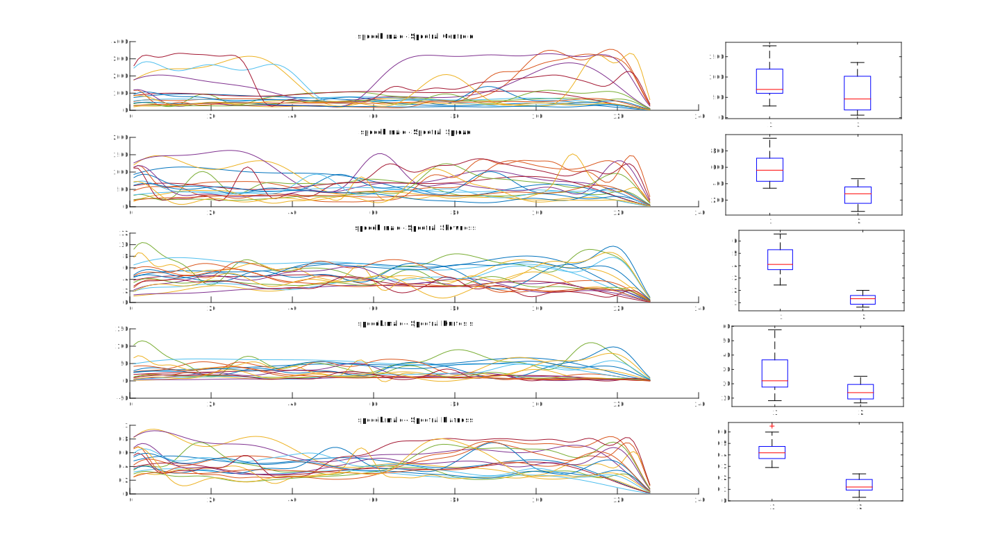
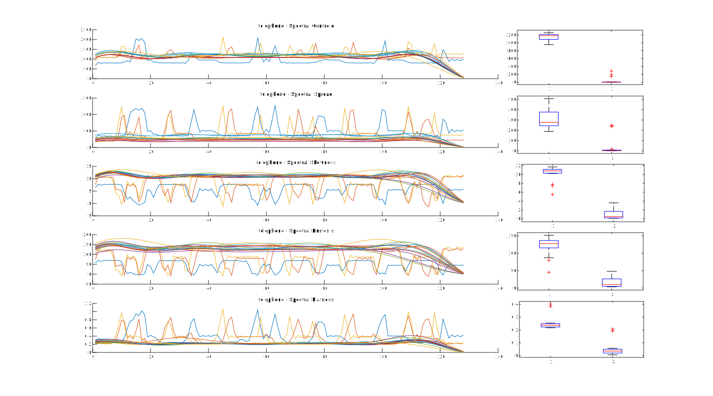
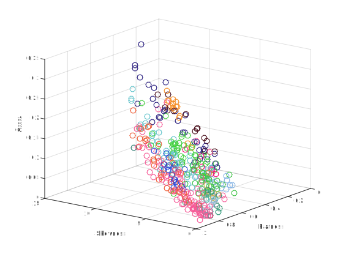
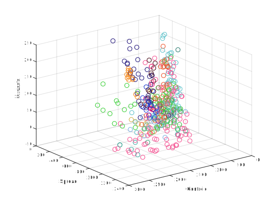



# Introduction

The present tutorials are designed to implement the core notions seen in [machine learning](/atiam-ml) lessons. Most techniques can be applied to any type of data from which sets of features can be computed. The exercises here will introduce the basic mecanisms behind these technics and then, we will target specific applications to musical or audio data.

{: .notice--blank}

# Reference slides

Download the [slides ](../documents/MML.Lesson.1.Introduction.pdf)

  * Introduction to artificial intelligence
  * Properties of machine learning
  * Nearest-neighbors
  

{: .notice--blank}

# Tutorial 

In this introduction, we will cover basic Music Information Retrieval (MIR) interactions, in which we process a dataset of sound files and try to observe the properties of their various temporal and spectral features. Hence, we will quickly review basic calculus required to perform further machine learning tasks. This tutorial is also intended to review basic Matlab coding and plotting operations.

{: .notice--blank}

## 0.0 - Reference code

Along the tutorials, we provide a reference code for each section. This code contains helper functions that will alleviate you from the burden of data import and other sideline implementations. You will find designated spaces in each file to develop your solutions. The code is in MATLAB and relies heavily on the concept of [code sections](https://fr.mathworks.com/help/matlab/matlab_prog/run-sections-of-programs.html) which allows you to evaluate only part of the code (to avoid running long import tasks multiple times and concentrate on the question at hand.

Get the baseline MATLAB code for all tutorials from this [zip file ](../documents/atiam_ml_exercises.zip)

{: .notice--blank}

## 0.1 - Datasets

In order to test our algorithms on audio and music data, we will work with several datasets that should be downloaded on your local computer first from this [link ](https://pchit.ircam.fr/public.php?service=files&t=a476001b408cfa9dacf8721149b9f151)

  |**Type**|*Origin*|
  |-------:|:---------|
  |**Classification**|[*MuscleFish*](http://knight.cis.temple.edu/~vasilis/Courses/CIS750/Papers/muscle_fish.pdf) dataset|
  |**Music-speech**|[*MIREX Recognition*](http://www.music-ir.org/mirex/wiki/2015:Music/Speech_Classification_and_Detection) set|
  |**Source separation**|[*SMC Mirum*](http://smc.inesctec.pt/research/data-2/) dataset|
  |**Speech recognition**|[*CMU Arctic*](http://festvox.org/cmu_arctic/) dataset|

For the first parts of the tutorial, we will mostly rely solely on the classification dataset. In order to facilitate the interactions, we provide the function `importDataset` that will allow to import all audio datasets along the tutorials.


function dataStruct = importDataset(classPath, type)
% classPath  : Path to the dataset (string)
% type       : Type of dataset (string: 'classify', 'plain', 'metadata')

% Returns the dataStruct structure with
dataStruct.filenames  % Cell containing the list of audio files
dataStruct.classes    % Vector of indexes assigning each file to a class
dataStruct.classNames % Cell of class names
  
  

{: .notice--blank}
  

  
**_Exercise_**  

  1. Launch the import procedure  and check the corresponding structure
  2. Code a count function that prints the name and number of examples for each classes 

{: .notice--info}

**Expected output** 

<input type="text" onclick="demoShow('basic1')"> Reveal </a>


  altotrombone 	: 13.
       animals 	: 9.
         bells 	: 7.
    cellobowed 	: 47.
        crowds 	: 4.
      laughter 	: 7.
      machines 	: 11.
          oboe 	: 32.
    percussion 	: 99.
 speech.female 	: 35.
   speech.male 	: 17.
     telephone 	: 17.
  tubularbells 	: 20.
   violinbowed 	: 45.
    violinpizz 	: 40.
         water 	: 7.
         total 	: 410.


{: .notice--blank}

## 0.2 - Preprocessing

We will rely on a set of spectral transforms that allow to obtain a more descriptive view over the audio information. As most of these are out of the scope of the machine learning course, we redirect you to a [signal processing course](https://ccrma.stanford.edu/~jos/sasp/) proposed by [Julius O. Smith](https://ccrma.stanford.edu/~jos/).  

The following functions to compute various types of transforms are given as part of the basic package, in the `00_Preprocessing` folder  

  |**File**|*Transform*|
  |-------:|:----------|
  |`stft.m`       |[Short-term Fourier transform](https://en.wikipedia.org/wiki/Short-time_Fourier_transform)|
  |`fft2barkmx.m` |[Bark scale](https://en.wikipedia.org/wiki/Bark_scale) transform|
  |`fft2melmx.m`  |[Mel scale](https://en.wikipedia.org/wiki/Mel_scale) transform|
  |`fft2chromamx` |[Chromas vector](https://en.wikipedia.org/wiki/Harmonic_pitch_class_profiles)|
  |`spec2cep.m`   |[Cepstrum](https://en.wikipedia.org/wiki/Cepstrum) transform|
  |`cqt.m`        |[Constant-Q](https://en.wikipedia.org/wiki/Constant_Q_transform) transform|

In order to perform the various computations, we provide the following function, which performs the different transforms on a complete dataset.  


function dataStruct = computeTransforms(dataStruct)
% dataStruct   : Dataset structure with filenames

% Returns the dataStruct structure with
dataStruct.spectrumPower     % Power spectrum (STFT)
dataStruct.spectrumBark      % Spectrum in Bark scale
dataStruct.spectrumMel       % Spectrum in Mel scale
dataStruct.spectrumChroma    % Chroma vectors
dataStruct.spectrumCepstrum  % Cepstrum
dataStruct.spectrumConstantQ % Constant-Q transform
   

{: .notice--blank}

**Exercise**  

  

  1. Launch the transform computation procedure and check the corresponding structure
  2. For each class, select a random element and plot its various transforms on a single plot. You should obtain plots similar to those shown afterwards.
  3. For each transform, try to spot major pros and cons of their representation.

{: .notice--info}

**Expected output**

 

{: .notice--blank}

## 0.3 - Features

As you might have noted from the previous exercice, most spectral transforms have a very high dimensionality, and might not be suited to exhibit the relevant structure of different classes. To that end, we provide a set of functions for computing several spectral features in the `00_Features` folder, we redirect interested readers to this [exhaustive article](http://recherche.ircam.fr/anasyn/peeters/ARTICLES/Peeters_2003_cuidadoaudiofeatures.pdf) on spectral features computation.

  |**File**|*Transform*|
  |-------:|:----------|
  |`featureSpectralCentroid.m`|Spectral centroid|
  |`featureSpectralCrest.m`|Spectral crest|
  |`featureSpectralDecrease.m`|Spectral decrease|
  |`featureSpectralFlatness.m`|Spectral flatness|
  |`featureSpectralKurtosis.m`|Spectral kurtosis|
  |`featureSpectralRolloff.m`|Spectral rolloff|
  |`featureSpectralSkewness.m`|Spectral skewness|
  |`featureSpectralSlope.m`|Spectral slope|
  |`featureSpectralSpread.m`|Spectral spread|
  |`featureMFCC.m`|Mel-Frequency Cepstral Coefficients (MFCC)|

Once again, we provide a function to perform the computation of different features on a complete set. Note that for each feature, we compute the temporal evolution in a vector along with the mean and standard deviation of each feature. We only detail the resulting data structure for a single feature (`SpectralCentroid`).  


function dataStruct = computeFeatures(dataStruct)
% dataStruct   : Dataset structure with filenames

% Returns the dataStruct structure with
dataStruct.SpectralCentroid     % Temporal value of a feature
dataStruct.SpectralCentroidMean % Mean value of that feature
dataStruct.SpectralCentroidStd  % Standard deviation
  

{: .notice--blank}
  
**Exercise**

  1. Launch the feature computation procedure and check the corresponding structure
  2. This time for each class, superimpose the plots of various features on a single plot, along with a boxplot of mean and standard deviations. You should obtain plots similar to those shown afterwards.
  3. What conclusions can you make on the discriminative power of each feature ?
  4. Perform scatter plots of the mean features for all the dataset, while coloring different classes.
  5. What conclusions can you make on the discriminative power of mean features ?

{: .notice--info}

**Expected output**

*Question 0.3.2*  
   
*Question 0.3.4*  
 

{: .notice--blank}
