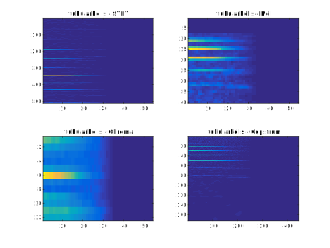
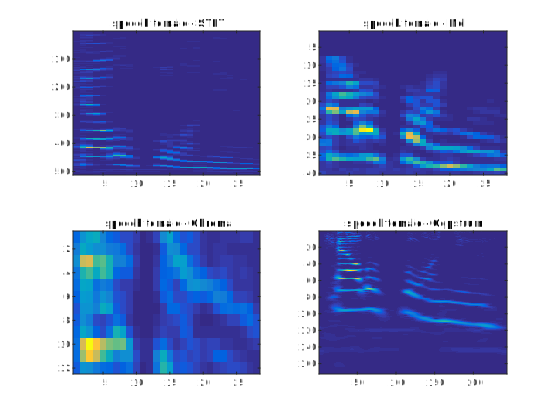



# Nearest neighbors

The present tutorials corresponds to the same first lesson and follows the introductory developments performed in the [previous tutorial](/atiam-ml-0-intro/). Based on the features computed, we will implement a simple *querying* and *classification* system based on [Nearest Neighbors](https://en.wikipedia.org/wiki/K-nearest_neighbors_algorithm).

{: .notice--blank}

# Reference slides

Download the [slides ](../documents/MML.Lesson.1.Introduction.pdf)

  * Introduction to artificial intelligence
  * Properties of machine learning
  * Nearest-neighbors

{: .notice--blank}

# Tutorial 

In this tutorial, we will cover the simplest querying and classification algorithms derived from the *$$k$$-Nearest Neighbor* method. The idea is to find the closest neighbor to a point by assessing its multi-dimensional distance to the rest of the dataset. Hence given a set of elements $$e_{i}$$, $$i\in\left[1,N\right]$$ and their corresponding features $$f_{i,k}\in\mathbb{R}^{n}$$ (which denotes the $$n$$-dimensional $$k^{th}$$ feature of the $$i^{th}$$ element), we need to compute a distance measure $$\mathcal{D}\left(f_{i,k},f_{j,k}\right)$$ between the elements of the dataset. This distance will express the dissimilarity between two features. For the first two questions of the tutorial, we will simply consider that the dissimilarity between features is expressed by their Euclidean $$(l_{2})$$ distance.

$$
\begin{equation}
\mathcal{D}\left(f_{i,k},f_{j,k}\right)=\sqrt{\sum_{n}\left(f_{i,k}^{n}-f_{j,k}^{n}\right)^{2}}
\end{equation}
$$

Given these distances, we can then compute the nearest neighbor of a particular element by selecting

$$
\begin{equation}
NN\left(e_{i}\right)=\underset{j\neq i}{argmin}\left(\frac{1}{K}\sum_{k=1}^{K}\left(\mathcal{D}\left(f_{i,k},f_{j,k}\right)\right)\right)
\end{equation}
$$

By looking at these given definitions, start by thinking about the following questions.  

{: .notice--blank}

 
**Questions**  

  1. We considered that features were n-dimensional, but what problems can arise from audio features?
  2. If we consider the equation of nearest neighbor, what constraints are implicitly made on the distances?
  3. Does the Euclidean distance seems like a sound way to measure the similarity between temporal features?

{: .notice--info}  

## 1.1 - Querying 

In a first step, we can use the nearest-neighbor method to devise a very simple *querying* system. This type of method is typically used in many systems such as *Query By Humming (QBH)* softwares (similar to [Shazam](http://www.shazam.com/)). As previously, we provide a baseline code in the main script. This allows to create a $$ N x f $$ distance matrix `dataMatrix` corresponding to the features of the $$ N $$ elements of the datasets. We selected here only the *SpectralCentroidMean, SpectralFlatnessMean* and *SpectralSkewnessMean* features.

{: .notice--blank}

**Exercise**  

  1. Complete the code to compute the set of distances between a random element and the rest of the dataset.
  2. Complete the plotting code in order to plot the element and its 10 nearest neighbors.
  3. Check that you obtain plots similar to those displayed below.
  4. Try the same piece of code by varying the `usedFeatures` list
  5. What can you tell about the discriminative power of features?
  6. (Optional) Extend your code to include temporal features
  7. (Optional) Extend your code to a fully functional *Query-By-Example* (QBE) system.

{: .notice--info}  

**Expected output** [<a href="javascript:void(0)" class="abuttons" data-divid="div2">Reveal</a>]

 

{: .notice--blank}

## 1.2 - Classification

For the second part of this tutorial, we will rely on the same technique (computing the distance of a selected point to the rest of the dataset) in a classification framework. The overarching idea behind kNN classification is that elements from a same class should have similar properties in the *feature space*. Hence, the closest feature to those of an element should be from elements of its right class. These types of approaches are usually termed as *distance-based* classification methods.


function [probas, winnerClass] = knnClassify(dataStruct, testSample, k, normalize, useL1dist);
% This function is used for classifying an unknown sample using the kNN
% algorithm, in its multi-class form.
%
% Arguments :
% - dataStruct  : the data structure
% - testSample  : the input sample id to be classified
% - k           : the k (number of neighbors) parameter
% - normalize   : use class priors to weight results
% - useL1dist   : use L1 instead of L2 distance
% Returns :
% - probas      : an array that contains the classification probabilities for each class
% - winnerClass : the label of the winner class
  

{: .notice--blank}
  

**Exercise**  

  1. Update the `knnClassify` code to perform the k-NN classification function
  2. Run the algorithms for both 1-NN and 5-NN evaluation
  3. Plot the different confusion matrix to visually check the accuracies (you should obtain the values displayed in the following figure).
  4. Perform the same classification with various K and features to evaluate the properties and qualities of different parametrizations.
  5. (Optional) Automatize the evaluation of various configurations.

>{: .notice--info} 

**Expected output** [<a href="javascript:void(0)" class="abuttons" data-divid="div2">Reveal</a>]

 

{: .notice--blank}

## 1.3 - Evaluation

When proposing new algorithms for machine learning problems, the fundamental aspects of corresponding research lies in correctly evaluating their performances. Depending on the application, method proposed, dataset and even the nature of corresponding data, a plethora of evaluation measures can be used. We highly recommend the following articles for those interested in future work around machine learning, so that you develop your critical mind and do not limit yourself to narrow evaluations (by relying on statistical tests) and also that you avoid **cherry picking**  

  * Demšar, J. (2006).   Statistical comparisons of classifiers over multiple data sets.   The Journal of Machine Learning Research, 7, 1-30.   [PDF Link ](http://machinelearning.wustl.edu/mlpapers/paper_files/Demsar06.pdf)  
  * Sturm, B. L. (2013).   Classification accuracy is not enough.   Journal of Intelligent Information Systems, 41(3), 371-406. [PDF Link ](http://vbn.aau.dk/files/70797941/Sturm20121030.pdf)  
  * Keogh, E., & Kasetty, S. (2003).   On the need for time series data mining benchmarks: a survey and empirical demonstration.   Data Mining and knowledge discovery, 7(4), 349-371. [PDF Link ](http://citeseerx.ist.psu.edu/viewdoc/download?doi=10.1.1.13.2240&rep=rep1&type=pdf)  

However, for the scope of this tutorial, we will stick to the typical measures that are minimally required to evaluate your classifier. Overall, the most important aspects of evaluation lies in different ways of comparing the *real labels* (ground truth) to the *assigned labels* (picked by the classifier).

  * The **confusion matrix** is computed simply by counting the occurences in which a particular instance of a real label (row) is classified to an assigned label (column). This code is already provided in the starter code, and all the following measures can be derived directly from it.
  * The **overall accuracy** is computed as the ratio of correctly classified examples divided by the complete number of examples.
  * The (per-class) **precision** defines the ratio of examples correctly assigned to a class divided by the number of instances assigned to that class by the classifier.
  * The (per-class) **recall** defines the ratio of examples correctly assigned to a class divided by the number of instances really belonging to that class.
  * The **F1 measure** is defined as the ratio between the geometric and harmonic means between the precision and recall measures.

You can implement these measures by simply completing the starter code. If you have doubts about the implementation of these measures, you can check the corresponding [Wikipedia article](https://en.wikipedia.org/wiki/Precision_and_recall)

{: .notice--blank}

**Exercise**  

  1. Update the `knnClassify` code to perform the k-NN classification function
  2. Run the algorithms for both 1-NN and 5-NN evaluation
  3. Plot the different confusion matrix to visually check the accuracies (you should obtain the values displayed in the following figure).
  4. Perform the same classification with various K and features to evaluate the properties and qualities of different parametrizations.
  5. (Optional) Automatize the evaluation of various configurations.

>{: .notice--info} 
