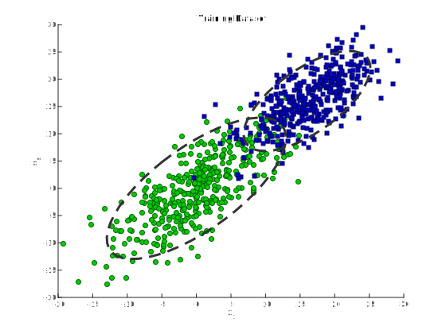
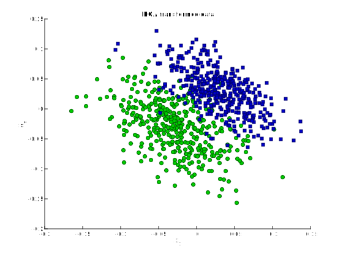
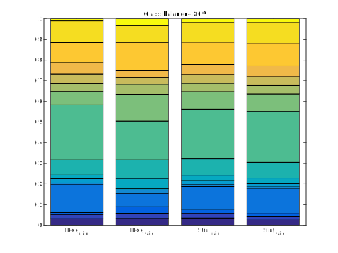



# Data complexity

The present tutorials covers recurrent problems that afflict almost all machine learning algorithms and how to alleviate them. First, we will discuss the *curse of dimensionnality* and how it can be reduced through dimensionality reduction techniques. Then, we will see examples of *over-fitting* and *over-training* that occurs in every non-convex problems. This hampers the capacity of an algorithm for *generalization*, which can be evaluated through the use of a *validation set* and *cross-validation*. These are also the main techniques to perform *model selection*.

{: .notice--blank}

# Reference slides

Download the [slides ](../documents/MML.Lesson.10.Data.Complexity.pdf)

The corresponding slides cover

  - Pitfalls of machine learning
  - Data complexity
  

{: .notice--blank}

# Tutorial 

## 10.0 - Curse, generalization

Choosing an "appropriate" machine learning algorithm depends on the problem, the size and desired recognition rate and computational performance. However, all algorithms fall prey to the same secular problems.

1. The curse of dimensionality
2. Poor generalization due to overfitting
3. Cross-validation and cherry picking

**Curse of dimensionality**

One of the biggest challenges of machine learning is to estimate the model parameters for complex problems, where large number of parameters implies an increased difficulty in estimating those parameters accurately from a limited number of training samples, a problem known as the ***curse of dimensionality***. In order to avoid it, learning algorithms are often accompanied by ***dimensionality reduction*** techniques. Common approaches are projection-based, such as ***Principal Component Analysis (PCA)*** (unsupervised) or ***Linear Discriminant (LDA)*** (supervised). It shall be noted though that regularization in classification models such as Logistic Regression, Support Vector Machines, or Neural Networks is to be preferred over using dimensionality reduction to avoid overfitting. An alternative to these approaches is the ***feature selection***. In these, the goal is to reduce the feature space $$D = {x_1, x_2, x_n}$$ to a subset of features $$D - n$$ in order to improve both the *accuracy* and *computational performance* of the algorithms.  The goal is to select a "sufficiently reduced" subset from the feature space $$D$$ "without significantly reducing" the performance of the classifier.

**Model generalization and overfitting**

Fitting a model to a training dataset can be iterated up to a perfect score, but interestingly this leads to a model that performs very poorly on unseen data. In these cases, the model is said to **generalize poorly** because of **overfitting**. A simple intuition for this effect is that the model becomes *too specialized* for the training data, and might simply memorize all training datapoints, while failing to make good predictions on test samples. However, the true goal is to find models that are good at predicting unseen data. Hence, we have to evaluate the predictive performance of our model mainly for

1. Estimating the *generalization accuracy* (predictive performance of our model on unseen data).
2. Increasing the predictive performance by selecting the best performing model from a given hypothesis space.
3. Identifying the algorithm that is best-suited for the problem at hand

Of course, we want to estimate the future performance of a model as accurately as possible. However, biased performance estimates are perfectly okay in model selection and algorithm selection if the bias affects all models equally. If we rank different models or algorithms against each other in order to select the best-performing one, we only need to know the "relative" performance.

**Cross-validation and cherry picking**

Cross-validation is a statistical technique to estimate the prediction error rate by splitting the data into training, cross-validation, and test datasets. A prediction model is obtained using the training set, and model parameters

We will see in the following how to adress these problems and a few useful tricks to do so.

{: .notice--blank}

## 10.1 - Reducing dimensions

**Pre-processing and whitening**  

Usually, features are first **pre-processed and standardized** through *scaling*. This allow to obtain features with properties close to a normal distribution, easing the work of the learning algorithm. A data pre-processing step for re-scaling features from different measurements to match proportions of a standard normal distribution (unit variance centered at mean=0).

**Principal Component Analysis (PCA)**  

PCA is a linear transformation technique that is commonly used to project a dataset onto a new feature subspace (for dimensionality reduction) where the new axes are the directions that maximize the variance/spread of the data. The underlying idea is that by doing so, we can reduce the dimensions of the dataset with minimal loss of information.

Listed below are the 6 general steps for performing a principal component analysis, which we will investigate in the following sections.

1. Take a dataset consisting of $$d$$-dimensional samples $$\{x_{1}, x_{2}, \ldots, x_{m}\}$$, where $$x_{i} \in \mathbb{R}^{d}$$
2. Compute the $$d$$-dimensional mean vector (means for every dimension of the whole dataset)
3. Compute the scatter matrix (or covariance matrix) of the whole data set

$$
\begin{equation}
\Sigma = \frac{1}{m} \sum_{i=1}^{m} (x_{i})(x_{i})^{T}
\end{equation}
$$

4. Compute eigenvectors ($$\mathbf{e}_{1}, \mathbf{e}_{2}, \dots, \mathbf{e}_{d}$$) and corresponding eigenvalues ($$\mathbf{\lambda}_{1}, \mathbf{\lambda}_{2}, \dots, \mathbf{\lambda}_{d}$$)
5. Sort the eigenvectors by decreasing eigenvalues and choose $$k$$ eigenvectors with the largest eigenvalues to form a $$d \times k$$ dimensional matrix $$\mathbf{W}$$ (where every column represents an eigenvector)
6. Use this $$d \times k$$ eigenvector matrix to transform the samples onto the new subspace. This can be summarized by the mathematical equation: $$\mathbf{y}=\mathbf{W}^{T} \times \mathbf{x}$$ (where $$\mathbf{x}$$ is a $$d \times 1$$-dimensional vector representing one sample, and $$\mathbf{y}$$ is the transformed $$k \times 1$$-dimensional sample in the new subspace).

{: .notice--blank}

**Exercise**

1. Implement the PCA algorithm
2. Generate a 3-dimensional dataset following a multivariate Gaussian
3. Evaluate the application of PCA to rotate this data
4. Evaluate the dimensionality reduction by projection

{: .notice--info}

**Expected output** [<a href="javascript:void(0)" class="abuttons" data-divid="div1">Reveal</a>]

 

{: .notice--blank}

**Linear Discriminant Analysis (LDA)**  

LDA is a linear transformation technique (related to PCA) that is also commonly used to project a dataset onto a new feature subspace. However, this approach is supervised as the new component axes are selected to maximize the spread between multiple classes. More information can be found on the corresponding [Wikipedia page](https://en.wikipedia.org/wiki/Linear_discriminant_analysis)

{: .notice--blank}

## 10.2 - Overfitting

Overfitting is one of the major problem encountered in machine learning. As explained earlier, this effect comes from the fact that the models becomes too specialized in the *training* dataset. In order to better define this phenomenon, we introduce a few concepts.

***Bias***
The *statistical* bias of an estimator $$\hat{\beta}$$ is the difference between its expected value $$E[\hat{\beta}]$$ and the true value of a parameter $$\beta$$ being estimated.

$$
\begin{equation}
Bias = E\big[\hat{\beta}\big] - \beta
\end{equation}
$$

So, if $$E\big[\hat{\beta}\big] - \beta = 0$$, then $$\hat{\beta}$$ is an unbiased estimator of $$\beta$$. We compute the prediction (generalization) bias as the difference between the expected prediction accuracy of our model and the true prediction accuracy. 

***Variance***
The variance of the estimator $$\hat{\beta}$$ and its expected value $$E[\hat{\beta}]$$

$$\text{Variance} = E\bigg[\big(\hat{\beta} - E[\hat{\beta}]\big)^2\bigg]$$

The variance is a measure of the variability of the model predictions if we repeat the learning process multiple times with small fluctuations in the training set. The more sensitive the model is towards these fluctuations, the higher the variance.

Hence, the goal of generalization is to reduce both the *bias* and the *variance* of our models. To prevent overfitting, we will need to have a way of computing both these values for our models.

**Holdout**

The holdout method is the simplest model evaluation technique. We take our labeled dataset and split it into a *training* set and a *validation* set. Then, we fit a model to the *training* data and predict the labels of the *validation* set. Hence, the amount of errors on the validation set constitutes our estimate of the prediction accuracy. We can also estimate the *optimism bias* as the difference between the training and validation accuracies. Typically, the splitting of a dataset into training and test sets is a simple process of *random subsampling*. We assume that all our data has been drawn from the same probability distribution (with respect to each class).

**Stratification**

Our dataset represents a random sample drawn from a probability distribution and we typically assume that this sample is representative of the true population. By subsampling without replacement, we alter the statistic (mean, proportion, and variance) of the sample. For instance, if we have take a random portion of the set, this will lead to non-uniform class distributions. The problem becomes even worse if our dataset has a high class imbalance upfront. In the worst-case scenario, the test set may not contain any instance of a minority class at all. Thus, the common practice is to divide the dataset in a stratified fashion. *Stratification* simply means that we randomly split the dataset so that each class is correctly represented in the resulting subsets.

- Repeated holdout validation and the bootstrap method for modeling uncertainty.
- *The holdout method for hyperparameter tuning* &mdash; splitting a dataset into three parts: a training, test, and validation set. 
- *K-fold cross-validation*, a popular alternative to model selection.
- *Nested cross-validation*, probably the most common technique for model evaluation with hyperparameter tuning or algorithm selection.

{: .notice--blank}

**Exercise**

1. Implement the holdout method for splitting a dataset
2. Implement the stratification method for splitting
3. Evaluate the effect on class imbalance
4. Take back one optimization algorithm from previous tutorials
5. Assess the variance, bias and optimism bias for both methods

{: .notice--info}

**Expected output** [<a href="javascript:void(0)" class="abuttons" data-divid="div2">Reveal</a>]

 

{: .notice--blank}

## 10.3 - Model selection

Most models usually contain **hyperparameters**, which are the *tuning parameters* of a machine learning algorithm (for instance, the number of neurons in one neural network layer or a value for setting the maximum depth of a decision tree). In contrast, model parameters are the parameters that a learning algorithm fits to the training data (the parameters of the model itself). In order to obtain the best possible model, these hyperparameters are tuned for the problem at hand. Several methods can be implemented towards this goal, usually termed *hyper-optimization*

1. **Grid search** is based on defining a given set of values for each parameters and explore all combinations of these.
2. **Gaussian processes** allow to perform a search on the hyperparameters based on the previous evaluations
3. **Random search** simply considers a random draw of the parameters at each iteration

{: .notice--blank}

**Exercise**

1. Implement the 3 methods of hyper-optimization
2. Random search is actually extremely efficient, can you take a guess on why ?

{: .notice--info}

## 10.4 - Cross-validation

Cross-validation allows to estimate the prediction error rate by splitting the data into training, cross-validation, and test datasets. A prediction model is obtained using the training set, and model parameters are optimized by the cross-validation set, while the test set is held primarily for empirical error estimation. A common approach to compare and evaluate different pre-processing techniques and models is cross-validation. In $$k$$-fold cross-validation, the original training dataset is split into $$k$$ different subsets (called *folds*) where $$1$$ fold is retained for testing the classifier and the other $$k-1$$ folds are used for training.

**Repeated Holdout Validation**

One way to obtain a more robust performance estimate that is less variant to how we split the data into training and test sets is to repeat the holdout method *k* times with different random seeds and compute the average performance over these *k* repetitions

$$
\begin{equation}
\text{ACC}_{avg} = \frac{1}{k} \sum^{k}_{j=1} {ACC_j}
\end{equation}
$$

where $$\text{ACC}_j$$ is the accuracy estimate of the *j*th test set of size *m*,

$$
\begin{equation}
\text{ACC}_j = 1 - \frac{1}{m} \sum_{i=1}^{m} \mathcal{L}\big(\hat{y}_i, y_i \big)
\end{equation}
$$

This repeated holdout procedure, sometimes also called *Monte Carlo Cross-Validation*, provides with a better estimate of how well our model may perform on a random test set (*bias*), and it can also give us an idea about our model stability (*variance*).

Usually, we can see that the variance of our estimate increases as the size of the test set decreases. Second, we see a small increase in the pessimistic bias when we decrease the size of the training set.

**Bootstrapping and empirical confidence intervals**

We would like to compute a confidence interval around our performance estimate to judge it's certainty or uncertainty. The idea behind the bootstrap is to generate "new samples" by sampling from an empirical distribution. The bootstrap method is a resampling technique for estimating a sampling distribution by generating *new* data from a population by repeated sampling from the original dataset *with replacement* in contrast, the repeated holdout method can be understood as sampling *without* replacement.

1. We are given a dataset of size *n*.
2. For *b* bootstrap rounds:
	1. We draw one single instance from this dataset and assign it to our *j*th bootstrap sample. We repeat this step until our bootstrap sample has size *n* &mdash; the size of the original dataset. Each time, we draw samples from the same original dataset so that certain samples may appear more than once in our bootstrap sample and some not at all.
3. We fit a model to each of the *b* bootstrap samples and compute the resubstitution accuracy.
4. We compute the model accuracy as the average over the *b* accuracy estimates

$$ \text{ACC}_{boot} = \frac{1}{b} \sum_{j=1}^b \frac{1}{n} \sum_{i=1}^{n} \bigg( 1 - L\big(\hat{y}_i, y_i \big) \bigg).$$

Originally, the bootstrap method aims to determine the statistical properties of an estimator when the underlying distribution was unknown and additional samples are not available. So, in order to exploit this method for the evaluation of predictive models, we can rely on *Leave-One-Out Bootstrap* (LOOB) technique. Here, we use *out-of-bag* samples as test sets for evaluation instead of evaluating the model on the training data.

Assuming we have a sample that has been drawn from a normal distribution $$N(\mu, \sigma^2)$$ with unknown mean $$\mu$$ and variance $$\sigma^2$$. It's probably been a while since we took Statistics I, but if there's one thing we surely remember, it's that we could use the sample mean $$\bar{x}$$ as a point estimate of $$\mu$$, and we could estimate the variance $$\sigma^2$$ and standard deviation as $$\sigma$$. The standard error is given by $$\frac{\sigma}{\sqrt{n}}$$. Using the standard error we can then compute a 95% confidence interval of the mean according to

$$\bar{x} \pm z \times \frac{\sigma}{\sqrt{n}}, $$

so that

$$\bar{x} \pm t \times \text{SE} $$

with z=1.96 for the 95% confidence interval. Since we estimate SD from the sample, we would have to consult a t-table to look up the actual value of *t*, which depends on the size of the sample &mdash; or the *degrees of freedom* to be precise. For instance, given a sample with n=100, we find that  $$t_{95} = 1.984 $$.

Similarly, we can compute the 95% confidence interval of the bootstrap estimate as

$$\text{ACC}_{boot} = \frac{1}{b} \sum_{i=1}^{b} \text{ACC}_i $$

and use it to compute the standard error

$$\text{SE}_{boot} = \sqrt{ \frac{1}{b-1} \sum_{i=1}^{b} (\text{ACC}_i - \text{ACC}_{boot})^2 }.$$

Finally, we can then compute the confidence interval around the mean estimate as

$$\text{ACC}_{boot} \pm t \times \text{SE}_{boot}.$$

{: .notice--blank}

**Exercise**  

1. Implement the repeated k-fold cross-validation procedure
2. Implement the computation of the confidence intervals
3. Evaluate the variance of classification algorithms

{: .notice--info}
