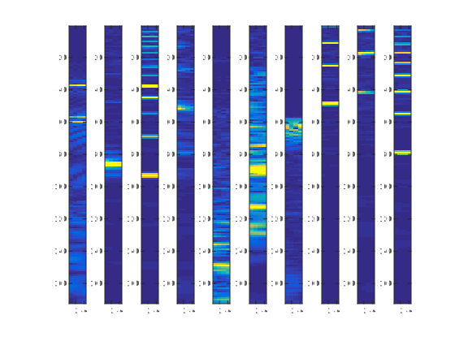
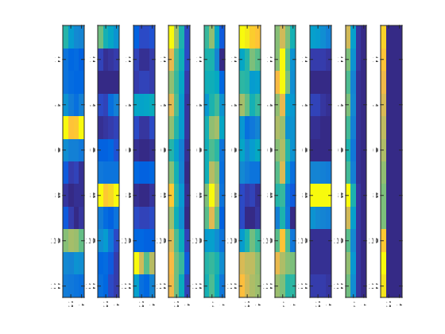



# Deep learning

The present tutorials covers the basic implementation towards *deep learning*. Most of this young research field is quite extensively based on the neural networks (that we implemented in a [previous tutorial](/atiam-ml-2-neural-networks/)). Therefore, a good knowledge of the previous implementations is required. We will first construct an **auto-encoder** to perform an *unsupervised learning* directly from any data. Then, we will see how we can *transfer* this knowledge to a more extensive *supervised classifier*. Finally, we will extend these implementations with the use and visualization of **convolutional filters**. This tutorial is an adaptation of the [UFLDL tutorials](http://ufldl.stanford.edu/wiki/index.php/UFLDL_Tutorial) for audio data.

{: .notice--blank}

# Reference slides

Download the [slides ](../documents/MML.Lesson.11.Deep.Learning.pdf)

The corresponding slides cover

  - Deep learning
  - Applications

{: .notice--blank}

# Tutorial  

In this tutorial, we will use the self-taught learning paradigm with a *sparse autoencoder* in order to build an unsupervised audition system. Then, we will see how to transfer this learning and also rely on the *softmax classifier* (implemented in the [neural networks tutorial](/atiam-ml-2-neural-networks/)) to build a classifier for spectral windows.

First, you will train your sparse autoencoder on an **unlabeled** training dataset of audio data (in this case, you can use all the datasets from the tutorials, and even add your own audio files), which will be represented as a set of concatenated spectral windows (to keep the temporal information).

Then, we will extract these learned features from the *weights* of the network trained in an unsupervised fashion, in order to apply this knowledge to a **labeled** dataset of audio files (by using these features as inputs to a *softmax classifier*). Finally, we will extend this classifier by using *convolutional filters*.

{: .notice--blank}

## 8.1 - Sparse Auto-Encoders

The autoencoder aims at learning both an encoding function $$e\left(\mathbf{x}\right)$$ and a decoding function $$d\left(\mathbf{x}\right)$$ such that $${\textstyle d\left(e\left(\mathbf{x}\right)\right)=\tilde{\mathbf{x}}\approx\mathbf{x}}$$. Therefore, the AE is intended to learn a function approximating the identity function, by being able to reconstruct an approximation  $${\textstyle\tilde{\mathbf{x}}}$$ similar to the input $$\mathbf{x}$$ via a hidden representation. In the case of entirely random input data (for instance a set of IID Gaussian noise), this task would not only be hard but also quite meaningless. However, based on the assumption that there might exist an underlying hidden structure in the data (where part of the input features are consistently correlated), then this approach might be able to uncover and exploit these statistical regularities. The encoding function $$e:\mathbb{R}^{d_{x}}\rightarrow\mathbb{R}^{d_{h}}$$ maps an input $$\mathbf{x}\in\mathbb{R}^{d_{x}}$$ to an hidden representation $$\mathbf{h}_{\mathbf{x}}\in\mathbb{R}^{d_{h}}$$ by producing a deterministic mapping  

$$
\mathbf{h}_{\mathbf{x}}=e\left(\mathbf{x}\right)=s_{e}\left(\mathbf{W_{e}}\mathbf{x}+\mathbf{b}_{e}\right)
$$

where $$s_{e}$$ is a nonlinear activation function (usually the *sigmoid* function), $$\mathbf{W}_{e}$$ is a $$d_{h}\times d_{x}$$ weight matrix, and $$\mathbf{b}_{e}\in\mathbb{R}^{d_{h}}$$ is a bias vector.  

The decoding function $$d:\mathbb{R}^{d_{h}}\rightarrow\mathbb{R}^{d_{x}}$$ then maps back this encoded representation $$\mathbf{h_{x}}$$ into a reconstruction $$\mathbf{y}$$ of the same dimensionnality as $$\mathbf{x}$$  

$$
\mathbf{y}=d\left(\mathbf{h_{x}}\right)=s_{d}\left(\mathbf{W}_{d}\mathbf{h_{x}}+\mathbf{b}_{d}\right)
$$ 

where $$s_{d}$$ is the activation function of the decoder. Usually the weight matrix of the decoding layer $$\mathbf{W}_{d}$$ is tied to be the transpose of the encoder weight matrix $$\mathbf{W}_{d}=\mathbf{W}_{e}^{T}$$, in which case the AE is said to have tied weights.

Hence, training an auto-encoder can be summarized as finding the optimal set of parameters $$\theta=\left\{\mathbf{W}_{e},\mathbf{W}_{d},\mathbf{b}_{e},\mathbf{b}_{d}\right\}$$ (or $$\theta=\left\{ \mathbf{W},\mathbf{b}\right\}$$ in the case of tied weights) in order to minimize the reconstruction error on a dataset of training examples $$\mathcal{D}_{n}$$

$$  \mathcal{J}_{AE}\left(\theta\right)=\sum_{\mathbf{x}\in\mathcal{D}_{n}}\mathcal{L}\left(\mathbf{x},d\left(e\left(\mathbf{x}\right)\right)\right)
$$

Usual choices for the reconstruction error function $$\mathcal{L}$$ are either the squared error $$\mathcal{L}(x,y)=\left\Vert x-y\right\Vert ^{2}$$ (often used for linear reconstruction) or the cross-entropy loss of the reconstruction $$\mathcal{L}(x,y)=-\sum_{i=1}^{d_{x}}x_{i}log\left(y_{i}\right)+\left(1-x_{i}\right)log\left(1-y_{i}\right)$$ (if the input is interpreted as vectors of probabilities and a sigmoid activation function is used). 

As can be seen from the definition of the objective functions, by solely minimizing the reconstruction error, nothing prevents an auto-encoder with an input of $$n$$ dimensions and an encoding of the same (or higher) dimensionnality to simply learn the identity function. In this case, the AE would merely be mapping an input to a copy of itself. Surprisingly, it has been shown that non-linear autoencoders in this over-complete setting (with a hidden dimensionality strongly superior to that of the input) trained with stochastic gradient descent, could still provide useful representations, even without any additional constraints

We can see that the framework defined by AEs fit the overarching goal of unsupervised and self-taught learning, as it tries to exploit statistical correlations of the data structure to find a non-linear representation aimed at decomposing and then reconstructing the input. In the starting code, we provide the basic functions to perform this learning.

|**File**|*Explanation*|
|-------:|:---------|
|`base-toolboxes`|Toolboxes to perform learning|
|`display_network.m`|Network visualization function|
|`initializeParameters.m`|Random initialization of network weights|
|`params2stack.m`|Transform parameters as a stack|
|`pcaWhitening.m`|Perform PCA whitening on input data|
|`sampleSpectrums.m`|Sample from a set of spectrums|
|`sparseAutoencoderCost.m`|Cost and gradient function for an SAE|
|`stack2params.m`|Transform stack to a parameter|
|`stackedAECost.m`|Cost and gradient for multiple layers|
|`stackedAEPredict.m`|Prediction function for logistic regression|

In order to perform the various computations, we will use the `minFunc` package as an advanced optimizer and the unlabeled data (any audio files) to train a sparse autoencoder. However, we first need to prepare an input set, so that the given data is formatted to a common size (slices of audio input). In the following problem, you will implement the sparse autoencoder algorithm, and show how it discovers an optimal representation for spectral windows. 

Specifically, in this exercise you will implement a sparse autoencoder, trained with 4 consecutive spectral distributions (FFT, Mel, Bark or Cepstrum) using the L-BFGS optimization algorithm (this algorithm is provided in the `minFunc` subdirectory, which is a 3rd party CCA software).

**Inputs**

The first step is to generate a training set. To get a single training example $$x$$, we need to compute the spectral transform from a sound and then subsample a set of a given number of consecutive spectral frames. This will allow the network to learn from the complete spectro-temporal information. However, the sampled parts will need to be converted into vectors.

{: .notice--blank}
  
**Exercise**  

  

  1. Update the `sampleSpectrums` function to generate examples
  2. Test your function on different transforms to observe the outputs
  3. Check the random intialization of parameters

 {: .notice--info}

**Expected output** [<a href="javascript:void(0)" class="abuttons" data-divid="div1">Reveal</a>]

 

{: .notice--blank}

The learning of an autoencoder is based on a cost function that tries to reconstruct the input from a combination of hidden units. Hence, as underlined in the previous question, we will start by implementing the simplest reconstruction cost, given by  

$$  \mathcal{J}_{AE}\left(\theta\right)=\sum_{\mathbf{x}\in\mathcal{D}_{n}}\mathcal{L}\left(\mathbf{x},d\left(e\left(\mathbf{x}\right)\right)\right)=\sum_{\mathbf{x}\in\mathcal{D}_{n}}\left\Vert \mathbf{x}-\tilde{\mathbf{x}}\right\Vert ^{2}
$$

However, as discussed previously, solely minimizing the reconstruction error, nothing prevents an auto-encoder with an input of $$n$$ dimensions and an encoding of the same (or higher) dimensionnality to simply learn the identity function. One way to avoid this situation is to enforce a *sparsity constraint* on the learning. The idea is to force the network to make this reconstruction from fewer data. If we denote $$a^{h}_{j}\left(x\right)$$ as the activation of hidden unit $$j$$ in the hidden layer of the autoencoder when given a specific input $$x$$. Furthermore, let  

$$
\hat\rho_j = \frac{1}{m} \sum_{i=1}^m \left[ a^{h}_j(x_{i}) \right]
$$

be the average activation of hidden unit $$j$$ (averaged over the training set). We would like to (approximately) enforce the constraint  

$$
\hat\rho_j = \rho
$$

where $$\rho$$ is a given *sparsity parameter*, typically a small value close to zero. In other words, we would like the average activation of each hidden neuron $$j$$ to be small. To satisfy this constraint, the hidden unit's activations must mostly be near 0. To achieve this, we will add an extra penalty term to our optimization objective that penalizes $$\hat\rho_j$$ deviating significantly from $$\rho$$. Many choices of the penalty term will give reasonable results. We will choose the following  

$$
\sum_{j=1}^{n_{h}} \rho \log \frac{\rho}{\hat\rho_j} + (1-\rho) \log \frac{1-\rho}{1-\hat\rho_j}.
$$

Here, $$n_{h}$$ is the number of neurons in the hidden layer, and the index $$j$$ is summing over the hidden units in our network. If you are familiar with the concept of KL divergence, this penalty term is based on it, and can also be written

$$
\sum_{j=1}^{n_{h}} {\rm KL}(\rho || \hat\rho_j),
$$

where $$KL(\rho \mid \mid \hat\rho_j) = \rho \log \frac{\rho}{\hat\rho_j} + (1-\rho) \log \frac{1-\rho}{1-\hat\rho_j}$$ is the Kullback-Leibler (KL) divergence
 
Hence, we can simply define the cost function $$\mathcal{J}_{sparse}\left(\theta\right)$$ and the corresponding derivatives of $$\mathcal{J}_{sparse}$$ with respect to the different parameters as the original cost with the added constraint

$$
\mathcal{J}_{sparse}\left(\theta\right)=\mathcal{J}_{sparse}\left(\theta\right) + \beta \sum_{j=1}^{s_2} {\rm KL}(\rho \mid \mid \hat\rho_j)
$$ 

In order to test the validity of your implementation, you can use the method of [*gradient checking*](http://ufldl.stanford.edu/wiki/index.php/Gradient_checking_and_advanced_optimization), which allows you to verify that your numerically evaluated gradient is very close to the true (analytically computed) gradient.

**Implementation tip**: If you are debugging your code, perform the learning on smaller models and smaller training sets (using few training examples and hidden units) to speed things up.

{: .notice--blank}
  
**Exercise**  

  
  
  1. Update the `sparseAutoencoderCost` to perform the simple Euclidean cost.  
  2. Test your algorithm and visualize the learned filters.  
  3. Update the `sparseAutoencoderCost` to include the *sparsity constraint*.  
  4. Test your algorithm and compare the results.  
  5. Also add the *weight decay* to further regularize learning.  

{: .notice--info}  

## 8.2 - Training and visualizing 

Once you have coded and verified your objective and derivatives, you can train the parameters of the model and use it to extract features from the spectral windows. Equiped with the code that computes $$\mathcal{J}_{sparse}$$ and its derivatives, we can now minimize $$\mathcal{J}_{sparse}$$ with respect to its parameters, and thereby train our sparse autoencoder.  

We will use the L-BFGS algorithm. This is provided to you in a function called `minFunc` (code provided by Mark Schmidt) included in the starter code. (For the purpose of this assignment, you only need to call minFunc with the default parameters). The minFunc code assumes that the parameters to be optimized are a long parameter vector; so we will use the $$\theta$$ parameterization (one long vector containing all parameters) rather than passing each parameter separately.  

In the starter code, we have provided a function for initializing the parameters. We initialize the biases $$b^{h}_i$$ to zero, and the weights $$W^{h}_{ij}$$ to random numbers drawn uniformly from the interval $$\left[-\sqrt{\frac{6}{n_{\rm in}+n_{\rm out}+1}},\sqrt{\frac{6}{n_{\rm in}+n_{\rm out}+1}}\,\right]$$, where $$n_{in}$$ is the fan-in (the number of inputs feeding into a node) and $$n_{out}$$ is the fan-out (the number of units that a node feeds into).  

** Visualization **
After training the autoencoder, you can use `display_network` to visualize the learned weights.

{: .notice--blank}
  
**Exercise**  

  

  1. Run your full implementation on a reduced dataset.
  2. Perform the visualization in order to see the learned weights.
  3. Compare the results with using the full dataset.
  

{: .notice--info} 

## 8.3 - Logistic regression

As we have seen in the [Neural Networks tutorial](/atiam-ml-2-neural-networks/), in order to perform multi-class predictions, we cannot rely on simply computing the distance between desired patterns and the obtained binary value. The idea here is to rely on the *softmax regression*, by considering classes as a vector of probabilities. If you have implemented the logistic regression in the [previous tutorial](/atiam-ml-2-neural-networks/), you can simply copy and paste your code here. Otherwise, we recall the mathematical bases behind these computations.  

The desired answers will be considered as a set of *probabilities*, where the desired class is $$1$$ and the others are $$0$$ (called *one-hot* representation). Then, the cost function will rely on the softmax formulation

$$
\begin{equation}
\mathcal{L_D}(\theta) = - \frac{1}{m} \left[ \sum_{i=1}^{m} \sum_{j=1}^{k} 1\left\{y^{(i)} = j\right\} \log \frac{e^{\theta_{j}^{T} x^{(i)}}}{\sum_{l=1}^{k} e^{ \theta_{l}^{T} x^{(i)} }}  \right]
\end{equation}
$$

Therefore, we compute the output of the softmax by taking 

$$
\begin{equation}
p(y^{(i)} = j | x^{(i)}; \theta) = \frac{e^{\theta_{j}^{T} x^{(i)}}}{\sum_{l=1}^{k} e^{ \theta_{l}^{T} x^{(i)}} }
\end{equation}
$$

By taking derivatives, we can show that the gradient of the softmax layer is

$$
\begin{equation}
\nabla_{\theta_{j}} \mathcal{L_D}(\theta) = - \frac{1}{m} \sum_{i=1}^{m}{ \left[ x^{(i)} \left( 1\{ y^{(i)} = j\}  - p(y^{(i)} = j \mid x^{(i)}, \theta) \right) \right]}
\end{equation}
$$

In `softmaxCost`, implement code to compute the softmax cost function $$J(\theta)$$. Remember to include the weight decay term in the cost as well. Your code should also compute the appropriate gradients, as well as the predictions for the input data (which will be used in the cross-validation step later).  

**Implementation Tip**  
Computing the ground truth matrix - In your code, you may need to compute the ground truth matrix $$M$$, such that $$M(r, c)$$ is $$1$$ if $$y(c) = r$$ and $$0$$ otherwise. This can be done quickly, without a loop, using the MATLAB functions sparse and full. Specifically, the command `M = sparse(r, c, v)` creates a sparse matrix such that $$M(r(i), c(i)) = v(i)$$ for all i. This code for using sparse and full to compute the ground truth matrix is already provided in softmaxCost.m.

**Implementation tip: Preventing overflows**  
In the softmax regression, we compute the unbounded hypothesis of the input belonging to each class, which can lead to overflow. However, given the definition of the logistic function, the overall (relative) probabilities remain equivalent if we substract the same quantity from each of the $$\theta_j^T x^{(i)}$$. Hence, to prevent overflow, we shall simply subtract some large constant value from each of the $$\theta_j^T x^{(i)}$$ terms before computing the exponential. 

**Learning parameters**  
Now that you've verified that your gradients are correct, you can train your softmax model using the function softmaxTrain in softmaxTrain.m. softmaxTrain which uses the L-BFGS algorithm, in the function minFunc. \\

{: .notice--blank}
  
**Exercise**  

  

  - Update `softmaxCost` to compute the softmax cost
  - Train the softmax model by using `softmaxTrain` and the L-BFGS algorithm.
  - Evaluate the accuracy of training the softmax on different architectures.

{: .notice--info}  

## 8.4 - Transfer learning

Up to now, we have seen how to train a single AE, which will basically learn one abstraction over the raw input data. Hence, we would like to perform learning of several AEs, each time by feeding the output of the previous one, in order to learn higher-level abstractions. The *greedy layerwise* approach for pretraining a deep network works by training each layer in turn. We will see autoencoders can be "stacked" in a greedy layerwise fashion for pretraining (initializing) the weights of a deep network.  

A stacked autoencoder is a neural network consisting of multiple layers of sparse autoencoders in which the outputs of each layer is wired to the inputs of the successive layer. Formally, consider a stacked autoencoder with n layers. Using notation from the autoencoder section, let W(k,1),W(k,2),b(k,1),b(k,2) denote the parameters W(1),W(2),b(1),b(2) for kth autoencoder. Then the encoding step for the stacked autoencoder is given by running the encoding step of each layer in forward order  

$$
a^{(l)} = f(z^{(l)}) \\
z^{(l + 1)} = W^{(l, 1)}a^{(l)} + b^{(l, 1)}
$$

The decoding step is given by running the decoding stack of each autoencoder in reverse order  

$$
a^{(n + l)} = f(z^{(n + l)}) \\
z^{(n + l + 1)} = W^{(n - l, 2)}a^{(n + l)} + b^{(n - l, 2)}
$$

The information of interest is contained within a(n), which is the activation of the deepest layer of hidden units. This vector gives us a representation of the input in terms of higher-order features. The features from the stacked autoencoder can be used for classification problems by feeding a(n) to a softmax classifier.  

A good way to obtain good parameters for a stacked autoencoder is to use greedy layer-wise training. To do this, first train the first layer on raw input to obtain parameters W(1,1),W(1,2),b(1,1),b(1,2). Use the first layer to transform the raw input into a vector consisting of activation of the hidden units, A. Train the second layer on this vector to obtain parameters W(2,1),W(2,2),b(2,1),b(2,2). Repeat for subsequent layers, using the output of each layer as input for the subsequent layer.
This method trains the parameters of each layer individually while freezing parameters for the remainder of the model. To produce better results, after this phase of training is complete, fine-tuning using backpropagation can be used to improve the results by tuning the parameters of all layers are changed at the same time.

If one is only interested in finetuning for the purposes of classification, the common practice is to then discard the "decoding" layers of the stacked autoencoder and link the last hidden layer a(n) to the softmax classifier. The gradients from the (softmax) classification error will then be backpropagated into the encoding layers.

To give a concrete example, suppose you wished to train a stacked autoencoder with 2 hidden layers for classification of MNIST digits, as you will be doing in the next exercise. First, you would train a sparse autoencoder on the raw inputs x(k) to learn primary features h(1)(k) on the raw input. Next, you would feed the raw input into this trained sparse autoencoder, obtaining the primary feature activations h(1)(k) for each of the inputs x(k). You would then use these primary features as the "raw input" to another sparse autoencoder to learn secondary features h(2)(k) on these primary features. Following this, you would feed the primary features into the second sparse autoencoder to obtain the secondary feature activations h(2)(k) for each of the primary features h(1)(k) (which correspond to the primary features of the corresponding inputs x(k)). You would then treat these secondary features as "raw input" to a softmax classifier, training it to map secondary features to digit labels. Finally, you would combine all three layers together to form a stacked autoencoder with 2 hidden layers and a final softmax classifier layer capable of classifying the MNIST digits as desired.  

Concretely, for each example in the the labeled training dataset, we forward propagate the example to obtain the activation of the hidden units. This transformed representation is used as the new feature representation with which to train the softmax classifier.  

{: .notice--blank}

**Exercise**  

  

  1. Setup a target architecture.
  2. Train each autoencoder separately.
  3. Perform the *weight transfer* into a single network.
  4. Fine-tune this network to obtain a complete classifier.
  5. Evaluate your classifier on audio data.
  

{: .notice--info} 

## 8.4 - Convolutional layers

Finally.

{: .notice--blank}

**Exercise**  

  

  1. Code
  

{: .notice--info} 
