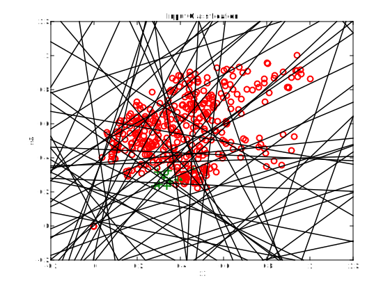
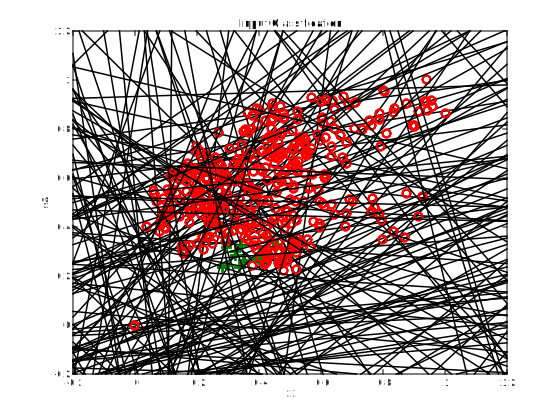



# Neural networks

The present tutorials covers the implementation of neural networks, starting with a single neuron and then going up to a multilayer perceptron applied to audio classification.

{: .notice--blank}

# Reference slides

Download the [slides ](../documents/MML.Lesson.2.Neural.networks.pdf)

  - The artificial neuron
  - Neural networks
  - Architecture zoo  
  

{: .notice--blank}

# Tutorial 

In this tutorial, we will cover a more advanced classification algorithm through the use of *neural networks*. The tutorial starts by performing a simple **single neuron** discrimination of two random distributions. Then, we will study the typical **XOR problem** by using a more advanced 2-layer **perceptron**. Finally, we generalize the use of neural networks in order to perform classification on a given set of audio files.

To simplify your work, we provide the following set of functions that you should find in the `02_Neural_Networks` folder

  |**File**|*Explanation*|
  |-------:|:---------|
  |`plot3view.m`|Allows to plot a 3-dimensional view of data points|
  |`plotBoundary.m`|Plots the decision boundary of a single neuron with 2-dimensional inputs|
  |`plotBoundarySurface.m`|Plots the decision surface of a single neuron with 3-dimensional inputs|
  |`plotPatterns.m`|Plots input patterns (bi-dimensionnal)|
  |`plotPatterns3D.m`|Plots 3-dimensional input patterns|
  |`xorAns.dat`|Class values for the XOR problem|
  |`xorPats.dat`|Point values for the XOR problem|

{: .notice--blank}

## 2.1 - Single neuron

For the first parts of the tutorial, we will perform the simplest classification model possible in a neural network setting, a single neuron. We briefly recall here that; given an input vector $$ \mathbf{x} \in \mathbb{R}^{n} $$, a single neuron computes the function  

$$
\begin{equation}
y=\sigma\left(\sum_{i = 1}^{n}w_{i}.x_{i} + b\right)
\label{eq1}
\end{equation}
$$

with $$ \mathbf{w} \in \mathbb{R}^{n} $$ a weight vector, $$ b $$ a bias and $$ \sigma\left(\right) $$ an *activation function*. Therefore, if we consider the *threshold* activation function ($$ \sigma_0\left(x\right)=1 $$ if $$ x \geq 0$$), a single neuron simply performs an *affine transform* and then a *linear* discrimination of the space. Geometrically, a single neuron computes an hyperplane that separates the space. In order to learn, we have to adjust the weights and know "how much wrong we are". To do so, we consider that we know the desired output $$ d $$ of a system for a given example $$ \mathbf{x} $$ (eg. a predicted value for a regression system, a class value for a classification system). Therefore, we define the loss function $$ \mathcal{L}_{\mathcal{D}} $$ over a whole dataset as

$$
\begin{equation}
\mathcal{L}=\sum_{j=1}^{k_{\mathcal{D}}}\left\Vert d_{j}-y_{j}\right\Vert ^{2}
\label{eq2}
\end{equation}
$$

In order to know how to change the weights based on the value of the errors, we need to now "how to change it to make it better". Therefore, we should compute the sets of derivatives of the error given each parameter

$$
\begin{equation}
\Delta\bar{\mathbf{w}}=\left(\frac{\delta\mathcal{L}_{\mathcal{D}}}{\delta w_{1}},\ldots,\frac{\delta\mathcal{L}_{\mathcal{D}}}{\delta w_{n}}\right)
\label{eq3}
\end{equation}
$$ 

{: .notice--blank}

**Exercise**  

  1. Perform the derivatives of the output given a single neuron
  2. Perform the derivatives for the bias as well

{: .notice--info}  

**Solution** [<a href="javascript:void(0)" class="abuttons" data-divid="divq1">Reveal</a>]

Given that we have simply an $$ L_2 $$ (Euclidean) error criterion on a single neuron for the time being, the update of the weights for a single example $$ x $$, with desired output $$ d $$ can be simply computed by 

$$
\begin{equation}
w_{j}^{t+1}=w_{j}^{t}+\eta.\left(d-y\right).x_{j}
\label{eq4}
\end{equation}
$$

with $$ \eta $$ the *learning rate* parameter (which controls the size of the update steps). 

Similarly, for the bias, we simply have to compute  

$$
\begin{equation}
b^{t+1}=b^{t}+\eta.\left(d-y\right)
\label{eq5}
\end{equation}
$$

{: .notice--success}

We will start by training a single neuron to learn how to perform this discrimination with a linear problem (so that a single neuron is enough to solve it). To produce such classes of problems, we provide a script that draw a set of random 2-dimensional points, then choose a random line in this space that will act as the linear frontier between 2 classes (hence defining a linear 2-class problem). The variables that will be used by your code are the following.  


desired       % classes of the patterns 
inputs        % 2 x n final matrix of random input patterns
weights       % 2 x 1 vector of neuron weights
bias          % 1 x 1 vector of bias
  

{: .notice--blank}
  

**Exercise**  

  1. Update the loop so that it computes the forward propagation error
  2. Update the loop to perform learning (based on back-propagation)
  3. Run the learning procedure, which should produce a result similar to the display below.
  4. Perform multiple re-runs of the learning procedure (re-launching produces different datasets)
  5. What observations can you make on the learning process?
  6. (Optional) Change the input patterns, and confirm your observations.
  6. (Optional) Incorporate the bias in the weights to obtain a **vectorized** code.

{: .notice--info}  

**Expected output** [<a href="javascript:void(0)" class="abuttons" data-divid="div1">Reveal</a>]

 

{: .notice--blank}

## 2.2 - 2-layer XOR problem

In most cases, classification problems are far from being linear. Therefore, we need more advanced methods to be able to compute non-linear class boundaries. The advantage of neural networks is that the same principle can be applied in a *layer-wise* fashion. This allows to further discriminate the space in sub-regions (as seen in the course). We will try to implement the 2-layer *perceptron* that can provide a solution to the infamous XOR problem. The idea is now to have the output of the first neurons to be connected to a set of other neurons. Therefore, if we take back our previous formulation, we have the same output for the first neuron(s) $$y$$, that we will now term as $$y_{1}$$. Then, we feed these outputs to a second layer of neurons, which gives

$$
\begin{equation}
y_{2}=\sigma\left(\sum_{i = 1}^{n}w_{i}.y_{1}^{i} + b\right)
\label{eq6}
\end{equation}
$$  

Finally, we will rely on the same loss $$\mathcal{L_{D}}$$ as in the previous exercise, but the outputs used are $$y_2$$ instead of $$y$$. As in the previous case, we now need to compute the derivatives of the weights and biases for several layers . However, you should see that some form of generalization might be possible for any number of layer.  

{: .notice--blank}

**Exercise**  

  1. Perform the derivatives for the last layer specifically
  2. Define a generalized derivative for any previous layer

{: .notice--info}  

**Solution** [<a href="javascript:void(0)" class="abuttons" data-divid="divq2">Reveal</a>]

In order to *propagate* the derivatives, we can simply rely on the chain rule

$$
\begin{equation}
\frac{\delta\mathcal{L_D}}{\delta w_{1}}=\frac{\delta\mathcal{L_D}}{\delta y_{2}}.\frac{\delta y_{2}}{\delta w_{1}}
\label{eq7}
\end{equation}
$$  

Therefore, we can compute the derivative for the last layer as

$$
\begin{equation}
\delta_{i}^{L}=\sigma'\left(y_{i}^{L}\right)\left[\delta_{i}^{u}-y_{i}^{L}\right]
\label{eq8}
\end{equation}
$$  

And for any previous layer, we rely on the development of the chain rule giving

$$
\begin{equation}
\delta_{i}^{l}=\sigma'\left(y_{i}^{l}\right)\sum_{j}w_{ij}^{l+1}\delta_{j}^{l+1}\mbox{ }l\in\left[1\ldots L-1\right]
\label{eq9}
\end{equation}
$$  

{: .notice--success}

We provide the prototypical set of XOR values in the `xorPat.mat` along with their class values in `xorAns.mat`. The variables that will be used by your code are the following.


patterns          % 2 x n matrix of random points
desired           % classes of the patterns 
inputs1           % 3 x n final matrix of inputs (accounting for bias)
nHiddens          % Number of hidden units
learnRate         % Learning rate parameter
momentum          % Momentum parameter
weights1          % 1st layer weights
weights2          % 2nd layer weights
TSS_Limit         % Sum-squared error limit
   

{: .notice--blank}

  
**Exercise**  

  1. Update the forward propagation and error computation (compared to desired).
  2. Update the back-propagation part to learn the weights of both layers.
  3. Run the learning, which should produce a result similar to that displayed below.
  4. Perform multiple re-runs of the learning procedure (re-launching with different initializations)
  5. What observations can you make on the learning process?
  6. What happens if you initialize all weights to zeros?
  7. (Optional) Implement the *sparsity* constraint in your neural network.
  7. (Optional) Implement the *weight decay* constraint in your network.
  7. (Optional) Add the *momentum* to the learning procedure.

{: .notice--info}

**Expected output** [<a href="javascript:void(0)" class="abuttons" data-divid="div2">Reveal</a>]

 

{: .notice--blank}

**Optional questions**

2. *Weight decay* constraint

As nothing constrains the weights in the network, we can note that usually all weights vector given a multiplicative factor might be equivalent, which can stall the learning (and lead to exploding weights). The *weight decay* allows to regularize the learning by penalizing weights with a too wide amplitude. The idea is to add this constraint as a term to the final loss (which leads to an indirect "pressure" on the learning process. Therefore, the final loss will be defined as

$$
\begin{equation}
\mathcal{L}_{final}=\mathcal{L_D} + \lambda \sum_{l} \sum_{i} \sum_{j} \left( W_{ij}^{l} \right)^{2}
\end{equation}
$$

where the parameter $$\lambda$$ controls the relative importance of the two terms.

3. *Momentum* in learning

Usually, in complex problems, the gradient can be very noisy and, therefore, the learning might oscillate widely. In order to reduce this problem, we can *smooth* the different gradient updates by retaining the values of the gradient at each iteration and then performing an update based on the latest gradient $$\delta_{i}^{t}$$ and the gradient at the previous iteration $$\delta_{i}^{t-1}$$. Therefore, a gradient update is applied as

$$
\begin{equation}
\delta_{final}^{t} = \delta_{i}^{t} + m.\delta_{i}^{t-1}
\end{equation}
$$

with $$m$$ the momentum parameter, which control the amount of gradient smoothing.

{: .notice--blank}

### 2.3 - 3-layer audio classification

Finally, we will attack a complete audio classification problem and try to perform neural network learning on a set of audio files. The data structure will be the same as the one used for parts 1 and 2. As discussed during the courses, even though a 2-layer neural network can provide non-linear boundaries, it can not perform "holes" inside those regions. In order to obtain an improved classification, we will now rely on a 3-layer neural network. The modification to the code of section 3.2 should be minimal, as the back-propagation will be similar for the new layer as one of the two others. We do not develop the math here as it is simply a re-application of the previous rules with an additional layer (which derivatives you should have generalized in the previous exercise).  

However, up until now, we only performed *binary classification* problems, but this time we need to obtain a decision rule for multiple classes. Therefore, we cannot rely on simply computing the distance between desired patterns and the obtained binary value. The idea here is to rely on the *softmax regression*, by considering classes as a vector of probabilities. The desired answers will therefore be considered as a set of *probabilities*, where the desired class is $$1$$ and the others are $$0$$ (called *one-hot* representation). Then, the cost function will rely on the softmax formulation

$$
\begin{equation}
\mathcal{L_D}(\theta) = - \frac{1}{m} \left[ \sum_{i=1}^{m} \sum_{j=1}^{k} 1\left\{y^{(i)} = j\right\} \log \frac{e^{\theta_{j}^{T} x^{(i)}}}{\sum_{l=1}^{k} e^{ \theta_{l}^{T} x^{(i)} }}  \right]
\end{equation}
$$

Therefore, we compute the output of the softmax by taking 

$$
\begin{equation}
p(y^{(i)} = j | x^{(i)}; \theta) = \frac{e^{\theta_{j}^{T} x^{(i)}}}{\sum_{l=1}^{k} e^{ \theta_{l}^{T} x^{(i)}} }
\end{equation}
$$

By taking derivatives, we can show that the gradient of the softmax layer is

$$
\begin{equation}
\nabla_{\theta_{j}} \mathcal{L_D}(\theta) = - \frac{1}{m} \sum_{i=1}^{m}{ \left[ x^{(i)} \left( 1\{ y^{(i)} = j\}  - p(y^{(i)} = j | x^{(i)}; \theta) \right) \right]
\end{equation}
$$

{: .notice--blank}

  
**Exercise**

  1. Based on the previous neural network, upgrade the code to a 3-layer neural network
  2. Implement the *softmax regression* on top of your 3-layer network
  3. Use the provided code to perform classification on a pre-defined set of features
  4. As previously, change the set of features to assess their different accuracies
  5. Evaluate the neural network accuracy for all features combinations
  6. What happens if the learning rate is too large ? What is this phenomenon ?
  7. (Optional) Perform a more advanced visualization of the learning process.

{: .notice--info}

**Expected output** [<a href="javascript:void(0)" class="abuttons" data-divid="div3">Reveal</a>]

 

{: .notice--blank}
