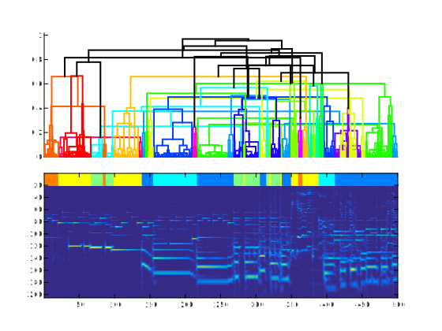
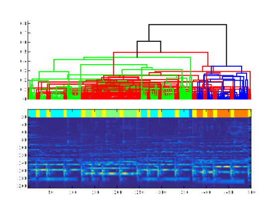
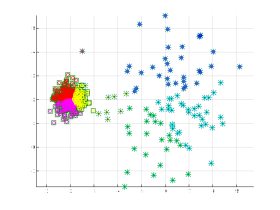
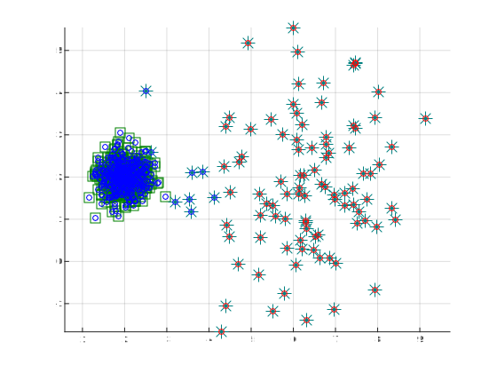



# Clustering

The present tutorials covers the notions of clustering. First, we will use existing implementations of hierarchical clustering to understand how any grouping of points can be considered as a clustering. Then, we will implement a simple algorithm for clustering data into a fixed number of groups, namely the *k-Means* algorithm. The goal here is to familiarize with the notions of unsupervised learning. Finally, we will apply both of these algorithms in order to perform a task of *audio summary generation*.

{: .notice--blank}

# Reference slides

Download the [slides ](../documents/MML.Lesson.4.Clustering.pdf)

  - Clustering motivations
  - K-Means and k-medoids
  - Hierarchical clustering  

{: .notice--blank}

# Tutorial 

In this part, we will use the principles of clustering to perform *unsupervised learning*. First, we will perform hierarchical The idea is to automatically discover the structure inside a spectrogram by using the simplest algorithm of clustering (k-Means algorithm). Hence, even though the results might be slightly drafty, it can give you a good sense of how to automatically uncover structure in an unsupervised way.  

{: .notice--blank}

## 4.1 Hierarchical audio thumbnailing

To start off the tutorial with a neat and sexy application, we will perform a simple shot at the problem of *audio structure discovery* and *audio thumbnailing*. The idea is to try to automatically infer the structure of a piece of music from its inner similarities in an *unsupervised way*. As you can see, this is a perfect

We briefly recall here that the principle of *hierarchical agglomerative clustering* is to start with a singleton cluster, and clusters are iteratively merged until one single cluster remains. This results in a "cluster tree," which is also called dendrogram. The opposite approach (starting with one cluster and divide into clusters until only singleton clusters remain) is called *divisive hierarchical clustering*. The algorithm can be summarized via the following pseudocode

**1**: Compute a distance or similarity matrix.  
**2**: Each data point is represented as a singleton cluster.  
**3**: Repeat  
**4**:    Merge two closest clusters (e.g., based on distance between most similar or dissimilar members).  
**5**:    Update the distance (or similarity) matrix.
**6**: Until one single cluster remains.

As the algorithm is very easy to implement, we will learn how to apply it on more complex problems. The idea here is to use a *smoothed version* (time-wise) of audio tracks and try to find the *structure* of this music in an unsupervised way. Therefore, we will try to find similarities. To do so, rely on the Matlab documentation for the `cluster` and `linkage` function to find a way to perform hierarchical clustering on the set of spectrogram windows.

{: .notice--blank}

**Exercise**  

  

  1. Update the loop to perform hierarchical clustering.
  2. Evaluate different distances and tracks to see the effects.
  3. Implement your **own distance function** between spectrograms.
  4. Find a way to plug your distance matrix inside the clustering.
  

{: .notice--info}  

**Expected output** [<a href="javascript:void(0)" class="abuttons" data-divid="div1">Reveal</a>]

 

{: .notice--blank}

## 4.2 K-Means algorithms 

First to perform the implementation of the K-Means algorithm, the following exercises will rely on a first synthetic dataset (linearly separated Gaussian distributions generated similarly to the SVM exercises). Hence, we will create a data set from two Gaussian distributions in a two-dimensional space.  

Then, to evaluate the limitations of the K-Means algorithm, we will generate a dataset of two circle distributions. We briefly recall here that the most basic way to perform data clustering is to first start with a random guess of the cluster centroids and then alternate between assigning the data points to different clusters and then updating the centroids of corresponding clusters.

We recall here the basic behind the k-Means algorithm. Given a set of observations ($$\mathbf{x}_{1}$$, $$\mathbf{x}_{2}$$, ..., $$\mathbf{x}_{n}$$), where each observation is a $$d$$-dimensional real vector, k-means clustering aims to partition the $$n$$ observations into $$k \leq n$$ sets $$S = \{S_{1}, S_{2}, \cdots, S_{k}\}$$ so as to minimize the within-cluster sum of squares (WCSS) (sum of distance functions of each point in the cluster to the $$K$$ center). In other words, its objective is to find:

$$
\begin{equation}
{\underset {\mathbf {S} }{\operatorname {arg\,min} }}\sum _{i=1}^{k}\sum _{\mathbf {x} \in S_{i}}\left\|\mathbf {x} -{\boldsymbol {\mu }}_{i}\right\|^{2} 
\end{equation}
$$

Given an initial set of k means m1(1),…,mk(1), the algorithm proceeds by alternating between two steps:

**Assignment step**: Assign each observation to the cluster whose mean yields the least within-cluster sum of squares (WCSS). Since the sum of squares is the squared Euclidean distance, this is intuitively the "nearest" mean. (Mathematically, this means partitioning the observations according to the Voronoi diagram generated by the means).

$$
S_{i}^{(t)}={\big \{}x_{p}:{\big \|}x_{p}-m_{i}^{(t)}{\big \|}^{2}\leq {\big \|}x_{p}-m_{j}^{(t)}{\big \|}^{2}\ \forall j,1\leq j\leq k{\big \}}
$$

where each $$x_{p}$$ is assigned to exactly one $$S^{(t)}$$, even if it could be assigned to two or more of them.  

**Update step**: Calculate the new means to be the centroids of the observations in the new clusters.

$$
m_{i}^{(t+1)}={\frac {1}{|S_{i}^{(t)}|}}\sum _{x_{j}\in S_{i}^{(t)}}x_{j}
$$

Since the arithmetic mean is a least-squares estimator, this also minimizes the within-cluster sum of squares (WCSS) objective.
The algorithm has converged when the assignments no longer change. Since both steps optimize the WCSS objective, and there only exists a finite number of such partitionings, the algorithm must converge to a (local) optimum. There is no guarantee that the global optimum is found using this algorithm.

{: .notice--blank}
  
**Exercise**  

  

  1. Update the ''kmeanspp'' function to implement the clustering algorithm.
  2. Perform the plot using the spread function to display the results of clustering.
  3. Compare the results depending on the number of clusters (example are displayed below).
  4. What observations can you make on the quality of these clusters ?
  5. Compare your results with the Matlab kMeans function.
  

{: .notice--info}  

**Expected output** [<a href="javascript:void(0)" class="abuttons" data-divid="div2">Reveal</a>]

 

{: .notice--blank}

## 4.3 Descriptors and grouping

We will now try to rely on the clustering functions that we just devised to perform an unsupervised grouping of a dataset of audio files. We already provided the code to perform this task, however the tuning is still to be made.  

{: .notice--blank}

**Exercise**  

  

  - Check that your ''kmeanspp'' function works on spectral features with 2 clusters.
  - Using the spread function, display the results of clustering for different numbers
  - How to devise a function to compute the overall quality of the clustering ?
  - Devise an algorithm to automatically adapt the number of clusters.
  - Compare results for different number of clusters

{: .notice--info}  

## 4.4 Audio thumbnailing

In this section, we will rely on the previously implemented kMeans algorithm to perform a spectral clustering and observe the obtained clusterings.  By completing the code yourself, try to perform a binarization followed by a clustering of spectrograms in order to group spectral components together.  

{: .notice--blank}
