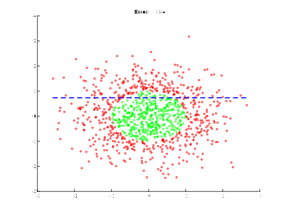
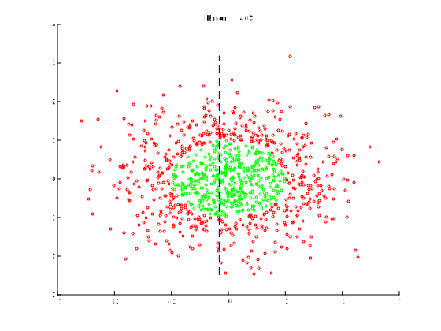
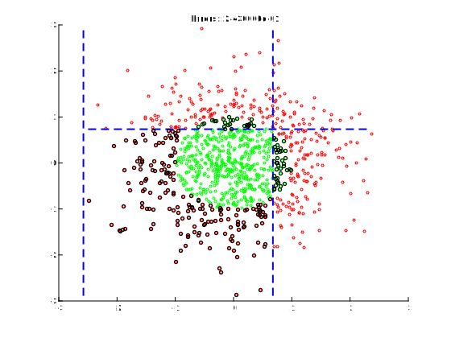
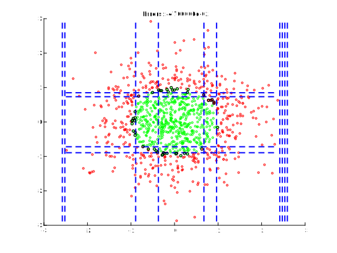



# Meta-heuristics

The present tutorials covers the use of different *meta-heuristics*. We will focus on the use of *boosting* by performing an implementation of the Adaboost algorithm. The tutorial does not cover the implementation of *genetic algorithms*, but interested students can find some nice [online tutorials](https://www.tutorialspoint.com/genetic_algorithms/index.htm).

{: .notice--blank}

# Reference slides

Download the [slides ](../documents/MML.Lesson.5.Boosting.pdf)

The corresponding slides cover

  - Genetic algorithms
  - Boosting  

{: .notice--blank}

# Tutorial 

## 5.0 - Adaboost algorithm

We recall here quickly the principles of boosting. We consider a dataset, for which each datapoint $$ \mathbf{x} $$, we have assigned a target **label** $$ \mathbf{d} $$. We use the already labelled data as **training data** in order to perform learning. We will consider here **binary classifications**, meaning that the labels can only be one of two values.

Each input datapoint $$ \mathbf{x} \in \mathbb{R}^{n} $$ is actually a vector containing several dimensions. In the framework of *boosting*, we first notice that (as we are in a binary classification setup), we can generate a classifier for our dataset using only a single parameter (ie. one of the dimensions $$ x_{i}, i \in \left[1,n\right] $$ of the input vectors), by simply selecting a **threshold** value $$ t $$. Therefore, a classification decision could be made by simply computing

$$
\begin{equation}
y = \left( x_{i} \geq t\right)
\end{equation}
$$

We could have generated a different classifier by simply choosing a different threshold or a different input dimension. Therefore, a classifier can be uniquely defined by choosing a parameter, and a threshold for that parameter, ie. $$\mathcal{C}_{k} = \{i, t\}$$. We consider these classifiers as **weak classifiers**, which is just a classifier that is better than pure guessing. That is, it classifies more than half of the labelled data correctly. Even if it's success rate is just 51%, it still counts as a weak classifier. (Oppositely, a **strong classifier** is one that has a very good success rate, like 90%).

Now the main question is, can we quantitatively combine several weak classifier and weight them in order to obtain a strong classifier ? The main idea behind solving this is that we could rely not only on which weak classifier performs, but mostly *on which point* do they work? This is the **"boosting"** in Adaboost. It boosts the weightage of classifiers that are more relevant. 

We will be considering here, the Adaboost (**Adaptive Boosting**) algorithm, which is an iterative solution to our main question.

  1. In the first iteration, pick the most accurate weak classifier.
  2. This weak classifier have obviously misclassified a lot of datapoints. The classifier that we pick in the next iteration should be better at correctly classifying **this misclassified data**. To do so, **each data point is assigned a weight** $$w_{i}$$. (in the first iteration,  all the datapoints had equal weightage, $$w_{i} = \frac{1}{N}$$). Then, the weight of the misclassified datapoints is incremented, and that of correctly labelled data is decremented. So the error rate of the second classifier is calculated as a weighted sum: if it misclassifies an already misclassified datapoint, it gets a higher error rate. 
  3. In the next iteration, the classifier with the smallest error rate on the weighted data is chosen. We again increment the weights of the datapoints that are **collectively misclassified** by the two weak classifiers, and decrement the weigths of those correctly classified.
  4. We repeat this process of reassigning weights and picking weak classifiers on the weighted data until we have made the error rate as small as we like.

So in a nutshell: Adaboost takes a lot of weak classifiers, assigns them appropriate weights, to make a strong classifier.

{: .notice--blank}

## 5.1 - Weak classifiers

We stated that a classifier can be defined by selecting a dimension and a threshold, its output being +1 or -1 depending on whether the input value is greater or smaller than the threshold. Also, we need to generate an error rate for weak classifiers, on the **weighted** dataset. We will define the function `weak_Classifier_error()` that takes a weak classifier, a labelled and weighted dataset as input, which outputs the error rate.

We provide a set of datapoints  

{: .notice--blank}

**Exercise**  

  1. Implement the `weakClassifier_error` function that computes the error of a weak classifier based on its threshold, target dimension and the *weighted* dataset of examples.
  2. Implement different methods to generate different weak classifiers
      1. Grid search 
      2. Random generation
      3. Candidate pool

{: .notice--info} 

**Expected output** [<a href="javascript:void(0)" class="abuttons" data-divid="div1">Reveal</a>]

 





## 5.2 - Main algorithm

Now that we have basic definitions for the weak classifiers, we can take a look at the complete code for the Adaboost algorithm. We will rely on the following set of variables


h                   % Tx3 array that stores the weak classifiers selected
  h[index][0]       % threshold
  h[index][1]       % dim (data dimension)
  h[index][2]       % pos (the sign of the classifier, +1/-1)
alpha               % T x 1 array that stores the weight of each weak classifier

            
It should be noted, that 'alpha' is used to construct the final classifier, which is a *weighted sum of the weak classifiers* that we have selected. 

$$
\begin{equation}
H\left(x\right) = sign\left(\alpha_{1}.h_{1}\left(x\right) + \alpha_{2}.h_{2}\left(x\right) + \dots + \alpha_{n}.h_{n}\left(x\right)\right)
\end{equation}
$$

Hence, the final output is the weighted sum of the outputs of each weak classifier. It is important to understand that this set of weights is entirely different than the set of weights $$\mathbf{w}$$ assigned to each datapoint, over each iteration, so that we could select a new classifier.

Therefore, the last remaining question is to decide how these weights are determined. We simply stated earlier that the weigths corresponding to the datapoints were incremented or decremented but not how exactly. First, we compute the sets of classifier weights $$\alpha_{i}$$ and then use it to reassign the datapoints weights $$w_{j}$$ (by taking care of normalizing both sets after computation). To do this, we use the following

$$
\begin{equation}
\alpha^{i}=\frac{1}{2}ln\left(\frac{1-\epsilon^{t}}{\epsilon^{t}}\right)
\end{equation}
$$

$$
\begin{equation}
w_{i}^{t+1}=\frac{w_{i}^{t}}{z}e^{-\alpha^{t}h^{t}\left(x\right)y\left(x\right)}
\end{equation}
$$

Proving convergence is pretty difficult. But you must know that the adaboost algorithm is guaranteed to converge to a strong classifier with an arbitrarily good success rate, given enough iterations (and some other caveats). For some intuition into where that weird expression of alpha came from, refer to [this link.](http://research.microsoft.com/en-us/um/cambridge/events/aistats2003/proceedings/156.pdf)

{: .notice--blank}

**Exercise**

  1. Fill the main steps of the boosting loop 
  2. Plot the evolution of the error rate across iterations
  3. Plot the different steps of classification in the input space
  

{: .notice--info} 

**Expected output** [<a href="javascript:void(0)" class="abuttons" data-divid="div2">Reveal</a>]

 

### 5.3 - Audio application

Before going further, we underline the fact that the concept of **boosting** itself is not limited to "threshold-based" classifiers. In fact, the more general idea of **ensembling** is based on constructing a stronger (classification, regression or otherwise) system, based on combining the output of several weaker systems.  

One of the interesting properties of the boosting algorithm that we have seen in the previous exercise is that it can give you a set of thresholds on each of the input dimensions that are fed to the system and therefore a direct view over the properties of a given class. The idea is that we can print out (after the learning loop) what are the sets of classifiers that have been selected (which property and at which threshold).

However, you should have notice (as was the case for the [Support Vector Machines tutorial](/atiam-ml-3-support-vector-machines/)) that these types of classifiers are inherently limited to *binary classification*, therefore we are 

{: .notice--blank}

**Exercise**

  1. Generate $$n$$ *one-to-one* different binary classification problems.
  2. Fill the main boosting loop and perform classification
  3. Plot the evolution of the error rate across iterations
  4. Print the descriptive dimensions and threshold selected for each class.
  

{: .notice--info} 

