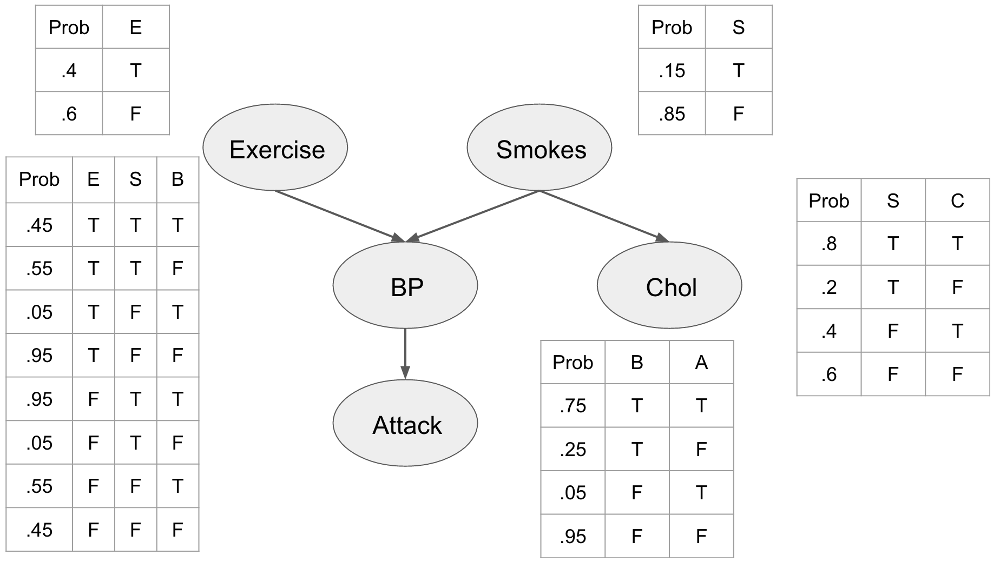



# Probabilistic models

The present tutorials covers the basic notions of *probabilities* and *probability distributions*. First, we will try to see how to sample from different distributions in order to generate new data. Then, this tutorial covers the basic theory behind the [Bayes theorem](https://en.wikipedia.org/wiki/Bayes%27_theorem), and how it can be used. We will implement a simple **Bayesian network** in order to perform observation and inference from a model.

{: .notice--blank}

# Reference slides

Download the [slides ](../documents/MML.Lesson.6.Probabilistic.Models.pdf)

The corresponding slides cover

  - Probabilities and distributions
  - Belief networks  

{: .notice--blank}

# Tutorial 

## 6.0 - Probabilities notations

We recall here the simple basics surrounding probabilities. The probability of an event $$a$$ is a real number $$P(a)$$, with $$0 \leq P(a) \leq 1$$, knowing that $$P(true)=1$$ and $$P(false)=0$$. The probability of two events occuring simultaneously is defined as $$P\left(a \wedge b \right)$$. Therefore, the probability of one event **or** the other occuring is defined as
$$
\begin{equation}
P\left(a \vee b \right) = P(a) + P(b) - P\left(a \wedge b \right)
\end{equation}
$$

The *conditional probability* of an event $$a$$ occuring *given* another event $$b$$ is denoted $$P \left(a \mid b \right)$$ and is defined as
$$
\begin{equation}
P \left(a \mid b \right) = \frac{P \left(a , b \right)}{P \left(b \right)}
\end{equation}
$$

This can be understood as the probability of event $$a$$ to occur if we restrict the world of possibilities to event $$b$$.  

The *chain rule* defines the probabilities of a set of events to co-occur simultaneously
$$
\begin{equation}
P \left(x_{1},...,x_{n} \right) = \prod_{i=n}^{1}{P \left(x_{i}\mid x_{i-1},..., x_{1} \right)}
\end{equation}
$$

Finally, we say that two events are independent if $$P(a\mid b) = P(a)$$.

{: .notice--blank}

## 6.1 - Probability Distributions

Let $$Z$$ be a random variable associated with a *probability distribution function* that assigns probabilities to the different outcomes $$Z$$ can take. We can divide random variables into three classifications:

-   **$$Z$$ is discrete**: Discrete random variables may only assume values on a specified list. 

-   **$$Z$$ is continuous**: Continuous random variable can take on arbitrarily exact values. 

- **$$Z$$ is mixed**: Mixed random variables assign probabilities to both discrete and continuous random variables, (i.e. a combination of the above two categories). 

**Expected Value**
The expected value $$E\left[X\right]$$ for a given probability distribution can be described as "the mean value for many repeated samples from that distribution." As the number of repeated observation goes to infinity, the difference between the average outcome and the expected value becomes arbitrarily small.

**Discrete Case**
If $$Z$$ is discrete, then its distribution is called a *probability mass function*, which measures the probability $$Z$$ takes on the value $$k$$, denoted $$P(Z=k)$$. Let's introduce one of the (many) useful probability mass functions. We say $$Z$$ is *Poisson*-distributed if:

$$
\begin{equation}
P\left(Z = k\right) =\frac{ \lambda^k e^{-\lambda} }{k!}, \; \; k \in \mathbb{N^{+}} 
\end{equation}
$$

$$\lambda \in \mathbb{R}$$ is a parameter of the distribution that controls its shape (usually termed the *intensity* of the Poisson distribution). By increasing $$\lambda$$, we add more probability to larger values. One can describe $$\lambda$$ as the *intensity* of the Poisson distribution. If a random variable $$Z$$ has a Poisson mass distribution, we denote it by

$$
\begin{equation}
Z \sim \text{Poi}(\lambda) 
\end{equation}
$$

One useful property of the Poisson distribution is that its expected value is equal to its parameter, i.e.:

$$E\large[ \;Z\; | \; \lambda \;\large] = \lambda $$

We will plot the probability mass distribution for different $$\lambda$$ values.

**Continuous Case**
A continuous random variable has a *probability density function*. An example of continuous random variable is a random variable with *exponential density*

$$
\begin{equation}
f_Z(z | \lambda) = \lambda e^{-\lambda z }, \;\; z\ge 0
\end{equation}
$$

When a random variable $$Z$$ has an exponential distribution with parameter $$\lambda$$, we say *$$Z$$ is exponential*

$$Z \sim \text{Exp}(\lambda)$$

Given a specific $$\lambda$$, the expected value of an exponential random variable is equal to the inverse of $$\lambda$$, that is

$$E[\; Z \;|\; \lambda \;] = \frac{1}{\lambda}$$

{: .notice--blank}

**Exercise**

1. Code the Poisson probability mass function
2. Code the exponential probability density functions 
3. Try these distributions with different $$\lambda$$ values. 
4. How to generate a random variable that follows one of these distributions ?

{: .notice--info}

## 6.2 - Graphical Models

Graphical Models allows to visualize probabilistic models, and also to express the dependencies between individual elements. There are several types of graphical models, but the most common are ***Bayes Nets*** and ***Hidden Markov Models*** (HMMs). Graphical models consist of two elements, ***nodes*** and ***arcs***.

The nodes are ***random variables***, they represent events that have some probability and can be *binary* *discrete* or *continuous*. 
As usual, the probabilities associated with each values of a random variable have to sum up to $$1.0$$.

Arcs are the directed links between the random variables, and you can think of them as **causal relations** between events. They denote what influence the parent has on the child node. This influence is expressed by a conditional probability. 

A node $$X$$ can have several parents, which means that its value is influenced by several factors. If there are no links between two variables, then they are ***independent of one another***.

{: .notice--blank}

**Bayes Nets**

If we combine several nodes in a network, we call it a ***Bayes Net***. The goal of such graphical models is to represent a *joint distribution* over a set of *random variables*, by using independence assumptions and thus reduce the complexity of the model. In Bayesian networks, nodes represent random variables and the paths represent the independence assumptions. To understand the basics of this method, we will implement0 a simple network for performing medical prediction of potential heart attacks. The idea is to have some pieces of information that we can collect like the patients cholesterol, whether or not they smoke, their blood pressure, and whether or not they exercise. In order to describe this system fully, we would need 2525 interactions. However, most of these interactions do not increase our predictive power. For example, we know that blood pressure is directly related to heart attacks and that both exercise and smoking can affect blood pressure. Thus, we can build a model where we use our domain knowledge to describe the interactions between our features.  

This network embeds several priors on our problem and our assumptions. First, we include the prior probabilities of the individual being a smoker, and whether or not they exercise. We can see that being a smoker affects the individuals cholesterol level influencing whether it is either high (T) or low (F). We also see that the blood pressure is directly influenced by exercise and smoking habits, and that blood pressure influences whether or not our patient is going to have a heart attack.

We assume that this network represents the joint distribution $$P \left( E,S,C,B,A \right) $$ and by describing these relationships explicitly we can use the chain rule of probability to factorize it as  

$$
\begin{equation}
P \left( E,S,C,B,A \right) = P \left( E \right) P \left( S \right) P \left( C \mid S \right) P \left( B \mid E,S \right) P \left( A \mid B \right) 
\end{equation}
$$  

Based on this network, we can make predictions about our patient, for instance how likely it is that a patient is exercising regularly, not smoking, not having high cholesterol, not having high blood pressure, and not getting a heart attack. This is can be computed straightforwardly from our conditional probability tables (CPTs).

$$
\begin{equation}
P \left( E=T,S=F,C=F,B=F,A=F \right) =P \left( E=T \right) P \left( S=F \right) P \left( C=F \mid S=F \right) P \left( B=F \mid E=T,S=F \right) P \left( A=F \mid B=F \right) =.4×.85×.6×.95×.95=.184
\end{equation}
$$

Even though this might be useful, the real power of the Bayesian network comes from the ability to reason about the whole model, and the effects that different variable observations have on each other. In order to perform this inference we’ll need three operations, **observation**, **marginalization**, and **factor products**.  

**Observation**
Observing a variable is a simple operation where we just ignore all unobserved aspects of that variable (meaning that we now know the real value of this variable). This translates into deleting all rows of a CPT where that observation is not true.

**Marginalization**
Marginalization is the process of changing the scope of a CPT by summing over the possible configurations of the variable to eliminate. It gives us a new probability distribution irrespective of the variable that we marginalized.

**Factor product**
A factor product is a way of joining two CPTs into a new CPT.

**Inference**
In this tutorial we are going to perform exact inference because our networks are fairly small. We will use the method of Variable elimination to make predictions in our network. The outline of the procedure is as follows

1. Observe variables
2. For each variable that we want to marginalize out
   a. Product all CPT’s containing said variable
   b. marginalize the variable out fo the combined CPT
3. Join all remaining factors
4. Normalize

Let’s use these methods to analyze how information flows in our network. We can instantiate our bayesian network as:
Let’s assume that all we know about the patient is that he is a smoker. What does that do to the probability that he will have a heart attack?  
infer(heart_net, ["c", "b", "e", "s"], ["s"], [1])  
As we would expect it increases. This is what is known as causal reasoning, because influence flows from the contributing cause (smoking) to one of the effects (heart attack). There are other ways for information to flow though. For example, let’s say that we know that the patient had a heart attack. Unfortunately, since they are now dead we can’t measure their blood pressure directly, but we can use our model to predict what the probability of them having high blood pressure is.  
infer(heart_net, ["c", "a", "e", "s"], ["a"], [1])  
Clearly having a heart attack suggests that the patient was likely to have had high blood pressure. This is an example of what is known as evidential reasoning. We used the evidence of a heart attack to better understand the patients initial state.
The last form of reasoning in these types of networks is known as intercausal reasoning. This is where information flows between two otherwise independent pieces of evidence. Take for example whether or not the patient exercises or smokes. If we observe that the patient has high blood pressure then the probability that he either smokes or doesn’t exercise increases.  
infer(heart_net, ["c", "a", "b"], ["b"], [1])  
If we then observe that the patient doesn’t exercise we see that the probability that he is a smoker jumps substantially.  
infer(heart_net, ["c", "a", "b", "e"], ["b", "e"], [1, 1])

This is an example of information flowing between two previously independent factors

{: .notice--blank}
