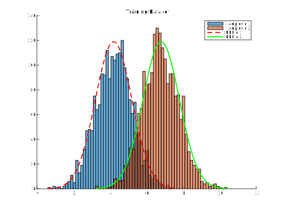
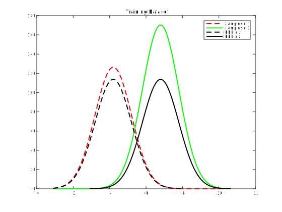
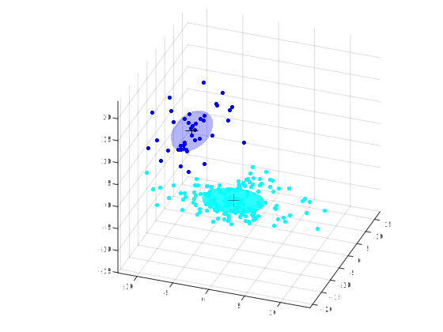
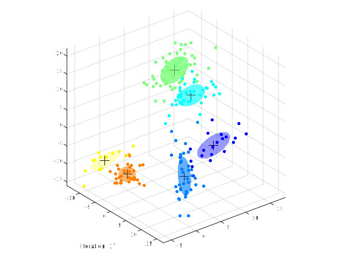



# Gaussian Mixture Models

The present tutorials covers the basics behind the use of **Expectation-Maximization** (EM) algorithm, in order to perform the estimation of Gaussian Mixture Models. First, we will lay down the problem of measuring from unseen groups. Then, we will develop the expectation, in order to perform the MLE on our data. Finally, the maximization step will allow to update the parameters in order to obtain a full classification model for the data.

{: .notice--blank}

# Reference slides

Download the [slides ](../documents/MML.Lesson.8.Gaussian.Mixture.Models.pdf)

The corresponding slides cover

  - Expectation Maximization
  - Mixture models  
  

{: .notice--blank}

## Tutorial 

Expectation Maximization (EM) is a powerful technique for creating maximum likelihood estimators when the variables are difficult to separate. Here, we set up a Gaussian mixture experiment with two Gaussians and derive the corresponding estimators of their means using EM.

{: .notice--blank}

## 8.1 - Unseen groups 

Suppose we have a population with two distinct groups of individuals with different heights. If we randomly pick an individual from the population, we don't know which group the individual belongs to. The goal is to estimate the mean heights of the two distinct groups when we have an unlabeled distribution sampled from both groups.

Both groups $$g_{1},g_{2}$$ are normally distributed, around two different means

$$ 
\begin{equation}
\mathcal{N}_{g_{i}}\left(x\right) =\mathcal{N}(x; \mu_{g_{i}},\sigma) 
\end{equation}
$$

Note that we fix the standard deviation $$\sigma$$ to be the same for both groups, but the means ($$\mu_{g_{1}},\mu_{g_{2}}$$) are different. The problem is to estimate the means given that you can't directly know which group you are picking from.

Then we can write the joint density for this experiment as

$$ 
\begin{equation}
f_{\mu_{g_{1}},\mu_{g_{2}}}(x,z)=  \frac{1}{2} \mathcal{N}_{g_{1}}(x) ^z \mathcal{N}_{g_{2}}(x) ^{1-z} 
\end{equation}
$$

where $$z=1$$ if we pick from group **$${g_{1}}$$** and $$z=0$$ for group **$${g_{2}}$$**. Note that the $$1/2$$ comes from the 50/50 chance of picking either group.  Unfortunately, since we do not measure the $$z$$ (latent) variable, we have to integrate it out of our density function to account for this handicap. Thus,

$$ 
\begin{equation}
f_{\mu_{g_{1}},\mu_{g_{2}}}(x)=  \frac{1}{2}  \mathcal{N}_{g_{1}}(x)+\frac{1}{2}  \mathcal{N}_{g_{2}}(x)
\end{equation}
$$

Now, since $$n$$ trials are independent, we can write out the likelihood:

$$ 
\begin{equation}
\mathcal{L}(\mu_{g_{1}},\mu_{g_{2}}|\mathbf{x})= \prod_{i=1}^n f_{\mu_{g_{1}},\mu_{g_{2}}}(x_{i})
\end{equation}
$$

We recall that the independent trials assumptions means that the joint probability is just the product of the individual probabilities. Usually, *maximum likelihood* allows to maximize this as the function of $$\mu_{g_{1}}$$ and $$\mu_{g_{2}}$$ based on all $$x_{i}$$. However, here we do not know which group we are measuring at each trial so we can not just estimate the parameters for each group separately.

{: .notice--blank}

**Exercise**

  1. Simulate the experiment by sampling two populations
  2. Try different means and see how overlapping regions could be solved.

{: .notice--info}

## 8.2 - Expectation maximization

The key idea of expectation maximization is that we will pretend to know the hidden $$z$$ value and use a maximum likelihood estimate (this is the *maximization* part), by computing an *expectation* (guess) over the missing variable (in this case, $$z$$). 

As usual, it is easier and more stable use the `log` of the likelihood function. It is useful to keep track of the *incomplete log-likelihood* ($$\log\mathcal{L}$$) since it can be proved that it is monotone increasing and provides a good way to identify coding errors.

{: .notice--blank}

**Expectation step**  

We denote $$\Theta=\left[\mu_{g_{1}},\mu_{g_{2}}\right]$$ as the set of parameters and $$x_{i}$$ the datapoints. The density function of $$z$$ and $$\Theta$$ can be written as the following

$$ 
\begin{equation}
\mathbb{P}(z,\Theta) = \frac{1}{2} \mathcal{N}_{g_{1}}(\Theta) ^ z \mathcal{N}_{g_{2}}(\Theta) ^ {(1-z)} 
\end{equation}
$$

For the expectation part we have to compute $$\mathbb{E}(z \mid \Theta)$$ 

{: .notice--blank}  

**Exercise**

  1. Compute the expression of the expectation $$\mathbb{E}(z \mid \Theta)$$ 
  2. Implement a function that computes it given a set of parameters

{: .notice--info}  

**Solution** [<a href="javascript:void(0)" class="abuttons" data-divid="divq1">Reveal</a>]

Since $$z\in \lbrace 0,1 \rbrace$$, the expression of $$\mathbb{E}(z \mid \Theta)$$  simplifies easily

$$ 
\begin{equation}
\mathbb{E}(z \mid \Theta) = 1 \cdot \mathbb{P}(z=1 \mid \Theta) + 0 \cdot \mathbb{P}(z=0 \mid \Theta) =  \mathbb{P}(z=1 \mid \Theta)  
\end{equation}
$$

Now, the only thing left is to find $$  \mathbb{P}(z=1 \mid \Theta) $$ which we can do using Bayes rule:

$$  
\begin{equation}
\mathbb{P}(z=1 \mid \Theta)  = \frac{ \mathbb{P}(\Theta \mid z=1)\mathbb{P}(z=1)}{\mathbb{P}(\Theta)} 
\end{equation}
$$

The term in the denominator comes from summing (integrating) out the $$z$$ items in the full joint density $$ \mathbb{P}(z,\Theta) $$

$$ 
\begin{equation}
\mathbb{P}(\Theta) = (\mathcal{N}_{g_{1}}(\Theta) + \mathcal{N}_{g_{2}}(\Theta))\frac{1}{2} 
\end{equation}
$$

and since $$\mathbb{P}(z=1)=1/2$$, we finally obtain

$$  
\begin{equation}
\mathbb{E}(z \mid \Theta) =\mathbb{P}(z=1 \mid \Theta)  = \frac{\mathcal{N}_{g_{1}}(\Theta)}{\mathcal{N}_{g_{1}}(\Theta) + \mathcal{N}_{g_{2}}(\Theta)} 
\end{equation}
$$

{: .notice--success}

**Maximization step**  

Now, given we we have this estimate for $$z_{i}$$,  $$\hat{z}_{i}=\mathbb{E(z \mid \Theta_{i})}$$, we can go back and compute the log likelihood estimate of

$$ 
\begin{equation}
J= \log\prod_{i=1}^{n} \mathbb{P}(\hat{z}_{i},\Theta_{i}) \\ = \sum_{i=1}^{n} \hat{z}_{i}\log \mathcal{N}_{g_{1}}(\Theta_{i}) +(1-\hat{z}_{i})\log \mathcal{N}_{g_{2}}(\Theta_i) +\log(1/2)  
\end{equation}
$$

by maximizing it using basic calculus. 

{: .notice--blank}  

**Exercise**

  
1. Derive the maximization of the log-likelihood
2. Implement a fonction that performs maximization on a set of data

{: .notice--info}

**Solution** [<a href="javascript:void(0)" class="abuttons" data-divid="divq2">Reveal</a>]

The trick is to remember that $$\hat{z}_{i}$$ is *fixed*, so we only have to maximize the $$\log$$ parts. This leads to

$$ 
\begin{equation}
\hat{\mu_{g_{1}}} = \frac{\sum_{i=1}^{n} \hat{z}_{i} x_{i}}{\sum_{i=1}^{n}  \hat{z}_{i} }
\end{equation}
$$

and for $$\mu_{g_{2}}$$

$$ 
\begin{equation}
\hat{\mu_{g_{2}}} = \frac{\sum_{i=1}^{n} (1-\hat{z}_{i}) x_{i}}{\sum_{i=1}^{n}  1-\hat{z}_{i} } 
\end{equation}
$$

{: .notice--success}

Now that we have both the *maximization* step and the *expectation* step ($$\hat{z}_{i}$$), we can simulate the algorithm and compute the estimates for both $$\mu_{a}$$ and $$\mu_{b}$$.

Expectation maximization is a powerful algorithm that is especially useful when it is difficult to de-couple the variables involved in a standard maximum likelihood estimation. Note that convergence to the "correct" maxima is not guaranteed, as we observed here. This is even more pronounced when there are more parameters to estimate (a much more detailed mathematical derivation is available [here](http://crow.ee.washington.edu/people/bulyko/papers/em.pdf)).

{: .notice--blank}  

**Exercise**

  1. Fill the main loop of the EM algorithm
  2. Plot the evolution of the values for both $$\mu_{a}$$ and $$\mu_{b}$$
  3. Plot the corresponding incomplete likelihood function
  4. Analyze the speed of convergence for the EM algorithm
  5. Plot the error surface (in terms of parameters)
  6. Test your algorithm for different initial values.

{: .notice--info}

**Expected output** [<a href="javascript:void(0)" class="abuttons" data-divid="div1">Reveal</a>]

 

## 8.3 - 3-dimensionnal GMM

The previous toy examples can easily be generalized to any given number of gaussians and any dimensionnality. We are given a data set $$D=\left\{ x_{1},\dots,x_{N}\right\}$$ where $$x_{i}$$ is a $$d$$-dimensional vector measurement. Assume that the points are generated in an IID fashion from an underlying density $$p(x)$$. We further assume that $$p(x)$$ is defined as a finite mixture model with $$K$$ components  

$$
p\left(x\mid\Theta\right)=\sum_{k=1}^{K}\alpha_{k}p_{k}\left(x\mid z_{k},\theta_{k}\right)
$$

where the $$p_{k}\left(x\mid z_{k},\theta_{k}\right)$$ are mixture components, ie. distribution defined over $$p(x)$$, with parameters $$\theta_{k}$$ and $$z_{k}$$ are mutually exclusive binary indicator variables representing the identity of the mixture component that generated $$x$$ and finally the $$\alpha_{k}=p\left(z_{k}\right)$$ are the mixture weights, representing the probability that a randomly selected $$x$$ was generated by component $$k$$.

We can compute the “membership weight” of data point $$x_{i}$$ in cluster $$k$$, given parameters $$\Theta$$ as

$$
w_{ik}=p\left(z_{ik}=1\mid x_{i},\Theta\right)=\frac{p_{k}\left(x\mid z_{k},\theta_{k}\right).\alpha_{k}}{\sum_{m=1}^{K}p_{m}\left(x\mid z_{m},\theta_{m}\right).\alpha_{m}}
$$

The membership weights above reflect our uncertainty, given $$x_{i}$$ and $$\Theta$$, about which of the $$K$$ components generated vector $$x_{i}$$. Note that we are assuming in our generative mixture model that each $$x_{i}$$ was generated by a single component

**Mixture model**
For $$x\in\mathbb{R}^{d}$$ we can define a Gaussian mixture model by making each of the $$K$$ components a Gaussian density with parameters $$\mu_{k}$$ and $$\Sigma_{k}$$. Each component is a multivariate Gaussian density  

$$
p_{k}\left(x\mid\theta_{k}\right)=\frac{1}{\left(2\pi\right)^{d/2}\left|\Sigma_{k}\right|^{1/2}}e^{-\frac{1}{2}\left(x-\mu_{k}\right)^{t}\Sigma_{k}^{-1}\left(x-\mu_{k}\right)}
$$

with its own parameters $$\theta_{k}=\left\{ \mu_{k},\Sigma_{k}\right\}$$.  

We define the *EM algorithm* for Gaussian mixtures as follows. The algorithm is an iterative algorithm that starts from some initial estimate of $$\Theta$$ (e.g., random), and then proceeds to iteratively update $$\Theta$$ until convergence is detected. Each iteration consists of an E-step and an M-step.  

**E-Step**  
Denote the current parameter values as $$\Theta$$. Compute $$w_{ik}$$ (using the equation above for membership weights) for all data points $$x_{i}$$ and all mixture components.  

**M-Step** 
Use the membership weights and the data to calculate new parameter values. Let $$N_{k}=\sum_{i=1}^{N}w_{ik}$$, i.e., the sum of the membership weights for the $$k$$-th component—this is the effective number of data points assigned to component $$k$$. Specifically we compute the new mixture weights  

$$
\alpha_{k}^{new}=\frac{N_{k}}{N}
$$

The updated mean is calculated in a manner similar to the previous exercises  

$$
\mu_{k}^{new}=\left(\frac{1}{N_{k}}\right)\sum_{i=1}^{N}w_{ik}.x_{i}
$$

Finally, we also the update rule for the covariance matrix identical to how we would normally compute an empirical covariance matrix, except that the contribution of each data point is weighted by $$w_{ik}$$  

$$
\Sigma_{k}^{new}=\left(\frac{1}{N_{k}}\right)\sum_{i=1}^{N}w_{ik}.\left(x_{i}-\mu_{k}^{new}\right)\left(x_{i}-\mu_{k}^{new}\right)^{t}
$$

After we have computed all of the new parameters, the M-step is complete and we can now go back and recompute the membership weights in the E-step, then recompute the parameters again in the E-step, and continue updating the parameters in this manner. Each pair of E and M steps is considered to be one iteration. 

{: .notice--blank}  

**Exercise**

  1. Fill the expectation step in the `emGMMFit` function
  2. Fill the maximization step in the same function
  3. Test your implementations by running the `emGMM3D` function
  4. Test your algorithm for different initial values.

{: .notice--info}

**Expected output** [<a href="javascript:void(0)" class="abuttons" data-divid="div2">Reveal</a>]

 

