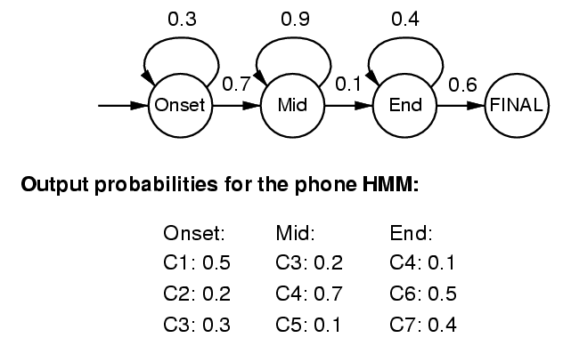



# Hidden Markov Models

The present tutorials covers the use of Hidden Markov Models (HMM) in order to perform sequence likelihood, parsing and model inference. Most of the tutorial will be devoted to the implementation of the forward-backward algorithm for performing the EM learning of the HMM models. Then, we will apply this algorithm to a problem of audio segmentation.

{: .notice--blank}

# Reference slides

Download the [slides ](../documents/MML.Lesson.9.Hidden.Markov.Models.pdf)

The corresponding slides cover

  - Undirected graphical models
  - Hidden Markov models  
  

{: .notice--blank}
  
# Tutorial 

## 9.0 - Introduction

Hidden Markov Models (HMMs) are used to model the changes over time (or another dimension) in which different elements might be connected. To capture this, we can include conditional probabilities, expressing how a random variable changes over time. In this model, we assume that each state depends *solely* on the previous one, not all previous states, which is called the ***Markov property***

$$
\begin{equation}
P\left(x_{t} \mid x_{t - 1}, x_{t - 2}, \dots x_{2},x_{1}\right) = P\left(x_{t} \mid x_{t - 1}\right)
\end{equation}
$$

Hence, the model can be represented as a **Graphical Probabilistic Model** (GPM), in which the connections (arcs) between different states (nodes) are weighted by the probability of going from one state to another. This type of model is simply called a **Markov chain**. In order to make it an **Hidden** Markov Model, we assume that there is some observable variables but in fact, the real transitions come from a random variable that we are actually interested in but is not observable directly.

Based on this model, several tasks can be performed by a HMM

  1. **Parse** of a sequence
  2. **Decoding** the hidden states from observations (*Viterbi*)
  3. **Model estimation** through Expectation-Maximization (*Baum-Welsh*)

In most applications, a single hidden layer is sufficient to model the behavior of a system. There are several algorithms to do the inference in a HMM, but we will be using the ***Viterbi*** algorithm for decoding the hidden states based on a sequence of observations and the ***Forward-Backward*** (or Baum-Welch) algorithm for labeling.

What we want in the end of the EM algorithm is the ***model parameters*** of our graphical model (the conditional probability tables) that best explain the observed data. The configuration we want is the one which **maximizes the likelihood** of observing our data given one set of parameters for the model (the global maxima). Hence, we model a joint probability distribution  $$P(\mathbf{o}, \mathbf{h})$$, which represents the probability of an observation $$\mathbf{o}$$ and a hidden variable $$\mathbf{h}$$ sequence occurring together

$$
\begin{equation}
P(\mathbf{o},\mathbf{h}) = P(\mathbf{h}) \times P(\mathbf{o}\mid\mathbf{h}) = P(\mathbf{o}) \times P(\mathbf{h}\mid\mathbf{o})
\end{equation}
$$

This means that the probability of seeing an observation and hidden sequence together $$P(\mathbf{o}, \mathbf{o})$$ is equal to the probability of the hidden sequence $$P(\mathbf{h})$$ times the probability that we generate these observations given the hidden sequence
$$P(\mathbf{o}\mid\mathbf{h})$$. It is also equal to the probability of seeing those observations $$P(\mathbf{o})$$ times the probability of turning those observations into that hidden sequence $$P(\mathbf{h}\mid\mathbf{o})$$.

What we want to maximize is the last part, $$P(\mathbf{h}\mid\mathbf{o})$$ (i.e., what is the best hidden sequence for the observations we see), so we can rewrite the previous equation as

$$
\begin{equation}
\frac{P(\mathbf{h}) \times P(\mathbf{o}\mid\mathbf{h})}{P(\mathbf{o})} = P(\mathbf{h}\mid\mathbf{o})
\end{equation}
$$

Since we observe $$\mathbf{o}$$, we know that $$P(\mathbf{o}) = 1.0$$, so we can simply write

$$P(\mathbf{h}\mid\mathbf{o}) = P(\mathbf{h}) \times P(\mathbf{o}\mid\mathbf{h})$$

If we now consider $$P(\mathbf{h})$$, it is a sequence of hidden states, where each depends on the previous one. Because of the Markov property, the probability of seeing the whole sequence $$h_{1}, h_{2}, \cdots h_{n}$$ (i.e., $$P(\mathbf{h})$$) is just the product of seeing each of the states following another state. We can write that as

$$
\begin{equation}
P(\mathbf{h}) = P(h_{1}) \times P(h_{2} \mid h_{1}) \times P(h_{3} \mid h_{2}) \times \cdots \times P(h_{n} \mid h_{n-1})
\end{equation}
$$

or for short

$$
\begin{equation}
P(\mathbf{h}) = P(h_{1}) \times \prod^{n}_{2} P(h_{i} \mid h_{i-1})
\end{equation}
$$

Hence, the complete optimization of all parameters can be expressed as the product of our two parameters.

$$ 
\begin{equation}
P(\mathbf{h} \mid \mathbf{o}) = P(h_{1}) \times P(o_{1} \mid h_{1}) \times \prod^{n}_{2} P(t_{i} \mid t_{i-1}) \times P(w_{i} \mid t_{i})
\end{equation}
$$

In order to compute the parameters, we have to develop a data structure that allows us to manipulate
them. We will use a HMM to represent the model and ***lattice-based dynamic programming*** to compute and manipulate the probabilities.   

In the remainder of this tutorial, we will rely on a simple modelisation of a ***phone***, in which we want to decompose the different states of a spoken unit, depending on the observed fundamental frequency. This model can be represented as  

  

We use three simple states that represent the onset, sustained and release part of a phone. Each of these states can produced different fundamental frequencies (Here we simply quantify to the octaves *C1* to *C7*). 

{: .notice--blank}

## 9.1 - Viterbi decoding

The idea behind HMM is that what we can see (obervations) was generated by something we cannot see (the hidden state), which is the ***generative interpretation***. Observations are connected by ***transition probabilities*** $$P(h_{i} \mid h_{i-1})$$, and emitted observations with ***emission probabilities*** $$P(o_{i} \mid h_{i})$$. We can translate this to a sequence of conditional probabilities

$$ 
\begin{equation}
P(\mathbf{h} \mid \mathbf{o}) = P(h_{1}) \times P(o_{1} \mid h_{1}) \times \prod^{n}_{2} P(h_{i} \mid h_{i-1}) \times P(o_{i} \mid h_{i})
\end{equation}
$$

We can model HMMs as a ***lattice*** of hidden states and observations, by replacing each random variable in the HMM with all possible values and drawing all possible arcs between them. It is important to specify all the hidden states you want to use. We start from a designated start state and from there choose one of the hidden state with the respective probability $$P(h)$$. From each of those possible hidden states, we can emit an observation with the respective probability $$P(o \mid h)$$. Then, we choose the next hidden state with some probability $$P(h_{i} \mid h_{i-1})$$.

Ultimately, we want to learn which hidden states follow one another, and which observations correspond to those sequences. Hence, as previously in this course, we need to reward good parameters (transitions that increase $$P(sequence)$$) and we decrease bad ones.  To do so, we will implement the *Viterbi* algorithm, which allows to discover the sequence of hidden states based on the observation of a sequence of emitted states.  

If we decompose our original question of finding $$P(o \mid h)$$, we can see that this turns to ask how likely it is that we end up at the node that has $$P(o \mid h)$$ as outgoing transition. And once we took that transition, what is the probability from the node we reach to the end of the sequence. Given the observation space $$O=\{o_{1},o_{2},\dots ,o_{N}\}$$, the state space $$S=\{s_{1},s_{2},\dots ,s_{K}\}$$, a sequence of observations $$Y=\{y_{1},y_{2},\ldots ,y_{T}\}$$, transition matrix $$A$$ of size $$K\cdot K$$ such that $$A_{ij}$$ stores the transition probability of transiting from state $$s_{i}$$ to state $$s_{j}$$, emission matrix $$E$$ of size $$K\cdot N$$ such that $$E_{ij}$$ stores the probability of observing $$o_{j}$$ from state $$s_{i}$$, an array of initial probabilities $$s$$  of $$K$$ such that $$\pi _{i}$$ stores the probability that $$x_{1}==s_{i}$$. We say a path $$X=\{x_{1},x_{2},\ldots ,x_{T}\}$$ is a sequence of states that generate the observations $$Y=\{y_{1},y_{2},\ldots ,y_{T}\}$$.

In this dynamic programming problem, we construct two 2-dimensional tables $$T_{1},T_{2}$$ of size $$K\cdot T$$. Each element $$T_{1}[i,j]$$ of $$T_{1}$$ stores the probability of the most likely path so far $$\hat{X}=\{\hat{x}_{1},{\hat {x}}_{2},\ldots ,{\hat {x}}_{j}\}$$ with $${\hat {x}}_{j}=s_{i}$$ that generates $$Y=\{y_{1},y_{2},\ldots ,y_{j}\}$$. Each element $$T_{2}[i,j]$$ of $$T_{2}$$ stores $${\hat {x}}_{j-1}$$ of the most likely path so far $$\hat {X}=\{\hat{x}_{1},{\hat {x}}_{2},\ldots ,{\hat {x}}_{j-1},{\hat {x}}_{j}\}$$ for $$\forall j,2\leq j\leq T$$

We fill entries of two tables $$T_{1}[i,j],T_{2}[i,j]$$ by increasing order of $$K\cdot j+i$$.  

$$
T_{1}[i,j]=\max _{k}{(T_{1}[k,j-1]\cdot A_{ki}\cdot E_{iy_{j}})}
$$, and  
$$
T_{2}[i,j]=\arg \max _{k}{(T_{1}[k,j-1]\cdot A_{ki})}
$$

Note that $$E_{iy_{j}}$$ does not need to appear in the latter expression, as it's constant with i and j and does not affect the argmax.

{: .notice--blank}

**Exercise**

  1. Fill the Viterbi algorithm function `hmmViterbi`
  2. Perform the decoding for the input sequences
  3. Try to observe differences in likelihood
  4. Define new models (emission and transition probabilities)
  5. What happens on the decoding of different prior models ?

{: .notice--info}

**Handling underflows**  
Since we will multiply probabilistic transitions, the numbers can quickly become very small and lead to an underflow (numbers too small to be handled numerically). As usual, to deal with this, we can use the logarithm of the probabilities. Furthermore, in this case, all multiplications become additions, and all additions have to be log-additions, a special computation that unfortunately is quite slow.

{: .notice--warning}

## 9.2 - Model inference

We use Forward-Backward in order to efficiently compute for each sequence how often we see each transition and what the probability of that sequence is. We need both for the fractional counts. Forward-Backward is the E step in an EM implementation: we compute the expected counts given the current model parameters. By using dynamic programming, we can compute how likely it is to arrive at each node (with the Forward algorithm), and to get to the end from there (with the Backward algorithm).

**Forward algorithm**

In the forward pass, we compute a new lattice with the same dimensions as the original one, which forward pass contains for each node the sum of all possible paths that lead up to there. These values are also called ***alphas***, where $$\alpha_{i, j}$$ denotes the probability of all paths up to node $$(i, j)$$ (assigning hidden state $$i$$ to observation $$j$$). 

$$\alpha_{start}$$ is always $$1.0$$. Each subsequent $$\alpha$$ is just the sum of all transitions arriving there, each multiplied by the $$\alpha$$ of the node where the transition originated.

$$\alpha_{end}$$ is the sum of all paths through the lattice, which is equal to $$P(sentence)$$. $$P(data)$$ is the
sum of all $$P(sentence)$$ in the data. In each iteration, just add up all the $$\alpha_{end}$$ of the sentences. Remember, $$P(data)$$ has to increase with each iteration, or there is something wrong. The EM algorithm guarantees that the likelihood of the data increases at each iteration over the data.

{: .notice--blank}

**Exercise**

  1. Implement the forward algorithm
  2. Compute the parse for the set of synthetic sequences
  3. Evaluate the different sequences 

{: .notice--info}

**Backward algorithm**

The backward pass is almost the same as the forward pass, just backwards. Again, we compute a new lattice, which contains for each node pass the sum of all possible paths that lead from that node to the end. These values are called ***betas***, where $$\beta_{i, j}$$ denotes the summed probability of all paths from node $$(i, j)$$ to the end. This time, however, we start at
the end, so $$\beta_{end}$$ is always $$1.0$$. A useful property for debugging is the fact that $$\beta_{start} = \alpha_{end}$$.

{: .notice--blank}

**Exercise**

  1. Implement the forward algorithm
  2. Verify the likelihoods of the sequences
  3. Check that you obtain coherent probabilities

{: .notice--info}

**Collecting fractional counts**

Once we have the alphas and betas, it is easy to compute for each transition how much it contributes
to $$P(sentence)$$. We have to know the likelihood of all possible paths arriving at a particular node $$(i,j)$$, and the probability – once we have taken the transition – from node $$(i,j+1)$$ to the end.  

We used the forward algorithm to get the probability of arriving at node $$(i,j)$$, and the backward algorithm to compute how likely it is from node $$(i,j+1)$$ to the end. We divide that by the likelihood of the sentence ($$= \alpha_{end}$$) in order to obtain the fractional counts.

{: .notice--blank}

**Exercise**

  1. Implement the computation of the fractional counts

{: .notice--info}

**The M Step**

Computing alphas and betas and collecting the fractional counts for all free parameter transitions over all examples is the ***E step***. This, as the name suggests, is one half of Forward-Backward EM. The ***M step*** is comparatively trivial: after having gone through all the data, we just normalize our fractional counts to get probabilities back (remember, probabilities are just normalized counts).

{: .notice--blank}

**Exercise**

  1. Implement the complete algorithm
  2. Run it on the set of sequences to obtain the model parameters

{: .notice--info}

## 9.3 - Audio applications

In order to 

{: .notice--blank}

**Exercise**

  1. Apply the previous algorithms to the audio dataset 
  2. Evaluate the accuracy of the obtained model

{: .notice--info}

