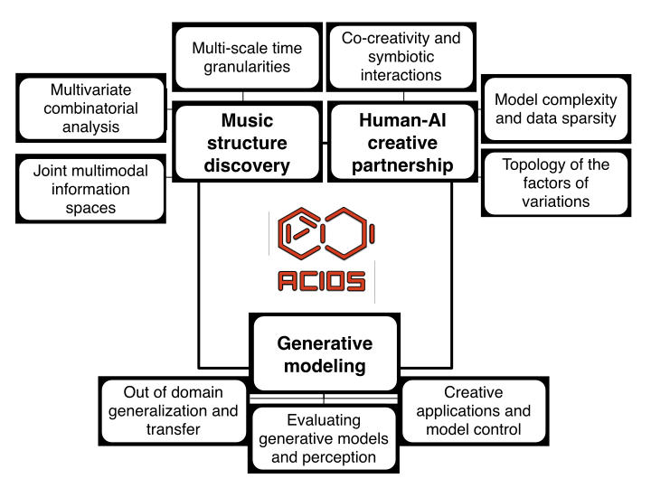



# Artificial creative intelligence

I currently direct the [ACIDS](http://acids.ircam.fr) (Artificial Creative Intelligence and Data Science) group at [IRCAM](http://www.ircam.fr), where we seek to model musical creativity through different types of probabilistic inference and machine learning approaches. The goal of the Artificial Creative Intelligence and Data Science (ACIDS) team at IRCAM is to model musical creativity by developing innovative artificial intelligence models. Studying creativity and musical improvisation can be seen as the epitome of symbiotic interactions, which can allow to move forward decisively in modeling improvisation in general human behavior. Hence this research aims to provide breakthrough tools for new leaps in musical creativity. Furthermore, having artificial intelligence models that can demonstrate creative behaviors could give rise to a whole new category of generic creative learning systems.

We developped multiple state-of-art creative applications done in the past years, and focus on various applications of the variational learning framework to disentangle factors of audio variation. Several recent papers produced by our team, allow to regularize the topology of the latent space based on perceptual criteria, working with both audio waveforms and spectral transforms and performing timbre style transfer between instruments. The development of these approaches as creative tools allow to increase musical creativity in contemporary music and were used in recent pieces played at renowned venues.

Our major object of study lies in the properties and perception of both [musical orchestration](/projects-orchestration) and [musical co-improvisation](/projects-ai/). Orchestration is the subtle art of writing musical pieces for orchestra, by combining the spectral properties of each instrument to achieve a particular sonic goal. In this context, the multivariate analysis of temporal processes is required given the inherent multidimensional nature of instrumental mixtures. Furthermore, time series need to be scrutinized at variable time scales (termed here granularities) as a wealth of time scales co-exist in music (from the identity of single notes up to the structure of entire pieces). Furthermore, orchestration lies at the exact intersection between the symbol (musical writing) and signal (audio recording) representations.

## Understand

### Multimodal

Music can be represented in multiple ways 
▪    The pressure wave is the physical phenomenon (raw waveform)
▪    Transforming the signal into a spectral representation exhibits frequencies
▪    While seeming the most natural, the symbolic score only contains pitch information

#### ACTOR Project

The ACTOR partnership is the first project to analyze musical orchestration in all of its complexity by regrouping mathematicians, computer scientists, psychologists, composers and performers to analyze orchestral pieces in all their representations (signal, spectrum and scores). We aim to construct the first-ever theory of musical orchestration, through an online orchestration treatise. You can find more information on the dedicated [project page](https://www.actorproject.org/)

### Temporal

Time is the essence of music, yet it is a complex, multi-scaled and multi-faceted vision of time. Hence, music need to be scrutinized at variable time granularities as a wealth of time scales co-exist in music (from the identity of single notes up to the structure of entire pieces). Hence, we introduce the idea of deep temporal granularity learning that could allow to find not only the salient features inside a dataset but also at which time scale these perform best

We recently developed the first live orchestral piano (LOP) system. The system provides a way to compose music with a full classical orchestra in real-time by simply playing on a MIDI keyboard.Our approach is to perform statistical inference on a corpus of midi files. This corpus contains piano scores and their orchestration by famous composers.This objective might seem too ambitious : learning orchestration through the mere observation of scores ? We believe that by observing the correlation between piano scores and corresponding orchestrations made by famous composers, we might be able to infer the spectral kwnoledge of composers. The probabilistic models we investigate are neural networks with conditional and temporal structures. You can find more information [on the dedicated webpage](https://qsdfo.github.io/LOP/)

## Interact

### Co-creativity

Our team fosters user-centric and interactive model, where we aim to put [humans as the central driver of creative AI](http://repmus.ircam.fr/dyci2/home). Improvisation is tremendously meaningful as a general model of human interactions, deeply involved in most situation where human decision, initiative and cooperation is at work. As a highly complex cognitive integration of skills, music improvisation is obviously a privileged ground for studying this field and developing models and tools that can be generalized to other domains of human intelligent actions as well. In particular, situations of collective musical interplay between human, or between human and artificial entities constitute an ideal observation and control deck for understanding and modeling symbiotic interaction in general. Thus advancing in solving the cyber-human improvisation problem in music is probably the best starting point in order to better understand improvisation at large in human behavior, and thus to progress decisively towards symbiotic interaction modeling.

## Generate

### Perception

One of the key issue in modeling creativity lies in how we could ever evaluate creative models (and account for perception). Indeed, there exists an infinite amount of potentially correct « solutions » to the realization of music. Therefore, we cannot rely on existing paradigms and rather need to understand the perception and organization of musical information

Timbre spaces have been used to study the relationships between different instrumental timbres,based on perceptual ratings. However, they provide limited interpretability, no generative capabilityand no generalization. Here, we show that variational auto-encoders (VAE) can alleviate these limitations, by regularizing their latent space during training in order to ensure that the latent space of audio follows the same topology as that of the perceptual timbre space. Hence, we bridge audio analysis, perception and synthesis [into a single system](https://acids-ircam.github.io/variational-timbre/)

### Exploration

Sound synthesizers are pervasive in music and they now even entirely define new music genres. However, their complexity and sets of parameters renders them difficult to master. We created an innovative generative probabilistic model that learns an invertible mapping between a continuous auditory latent space of a synthesizer audio capabilities and the space of its parameters. We approach this task using variational auto-encoders and normalizing flows Using this new learning model, we can learn the principal macro-controls of a synthesizer, allowing to travel across its organized manifold of sounds, performing parameter inference from audio to control the synthesizer with our voice, and  even address semantic dimension learning where we find how the controls fit to given semantic concepts, all [within a single model](https://acids-ircam.github.io/flow_synthesizer/). 

## Create

Our research work has been featured in a wide variety of contemporary music production, and several of our software were used for several musical compositions from well-known composers such as Jonathan Harvey, Yan Maresz and Marco Suarez. Recently, our team worked towards the use of generative AI models in order to produce a synthetic opera singer. This work was featured in the opera « La machine des monstres » by Daniele Ghisi. The goal of this research was to be able to hear the learning procedure of an AI, where the model represents a modern version of Shelley’s Frankenstein.

{: .notice--blank}
